# 🏠 Imóveis — Scatolin Imóveis

> **Coletado em:** 16/07/2026, 21:37:22
> **Fonte:** [imobiliariascatolin.com.br](https://www.imobiliariascatolin.com.br)

| Métrica | Quantidade |
|---|---|
| Total | 46 |
| Aluguel | 28 |
| Venda | 18 |

---

## 1. Salas Comerciais para Locação - Em frente ao hospital

- **Código:** 00094
- **Tipo:** Sala | **Finalidade:** Aluguel
- **Valor:** R$ 500
- **Endereço:** Rua Prado, 103, Zona Norte - Ilha Solteira/SP
- **CEP:** 15385188
- **Composição:** 2 Quartos, 2 Banheiros, 1m²

> SALAS COMERCIAIS DISPONÍVEIS PARA LOCAÇÃO
> 
> Clínica localizada em frente ao hospital, com grande visibilidade e acesso facilitado.
> 
> Salas com ar-condicionado, sendo:
> 1 sala com lavabo
> 1 sala com pia
> 
> Clínica com infraestrutura completa:
> Banheiros
> Recepção
> Copa
> Sala de espera
> 
> Entre em contato agora mesmo para agendar uma visita!
> 
> Sala menor com lavabo - R$500,00
> Sala maior com pia - R$700,00

**📷 5 foto(s):**

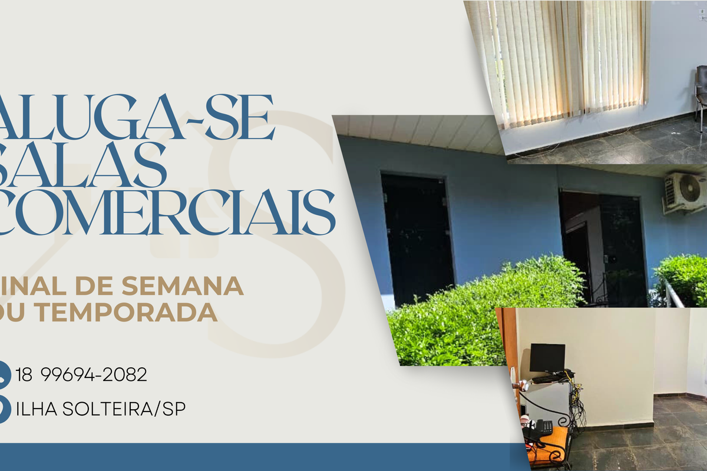

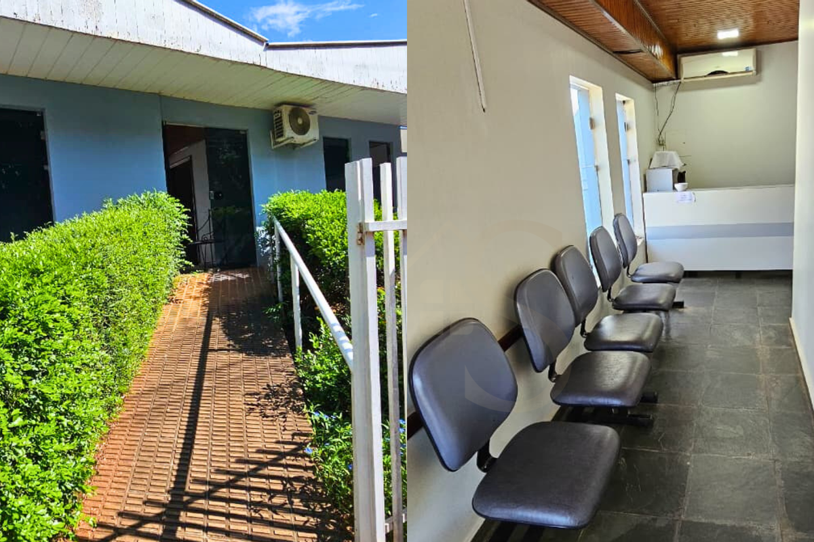

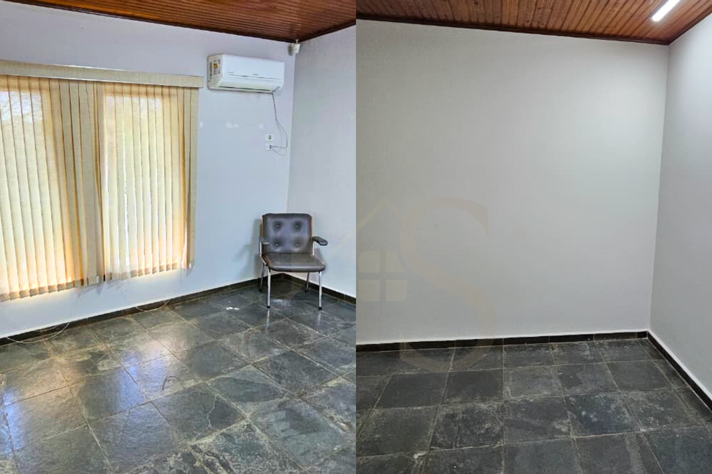

🔗 [Ver no site](https://imovel.sicadiweb.com.br/LOCACAO/DVI-IM-0232E56F5A024BDCA6FAC582F11E626A/IAC-IMOB-35AC99F2)

---

## 2. SOBRADO COM OU SEM MOBÍLIA DISPONÍVEL PARA  LOCAÇÃO!

- **Código:** 00037
- **Tipo:** Casa | **Finalidade:** Aluguel
- **Valor:** R$ 3.500
- **Endereço:** Rua Praia Joaquina, 87, Portal da Praia - Ilha Solteira/SP
- **CEP:** 15386014
- **Composição:** 1m²
- **Características:** Calçada, Churrasqueira, Corredor, Cozinha, Piscina, Quintal, Sala, Sala de jantar, Sala de TV, Varanda

> Excelente sobrado disponível para locação, ideal para quem busca conforto, lazer e praticidade em um só lugar.
> 
> O imóvel conta com:
> 
> 2 suítes climatizadas com ar-condicionado
> 
> Piscina refrescante com hidromassagem
> 
> Espaço gourmet com churrasqueira e freezer externo para manter as bebidas sempre geladas
> 
> Cozinha completa equipada com geladeira, fogão de 5 bocas, utensílios, panelas, pratos e muito mais
> 
> Ampla sala de jantar com mesa para 10 pessoas
> 
> Sala de TV com SKY 

**📷 7 foto(s):**

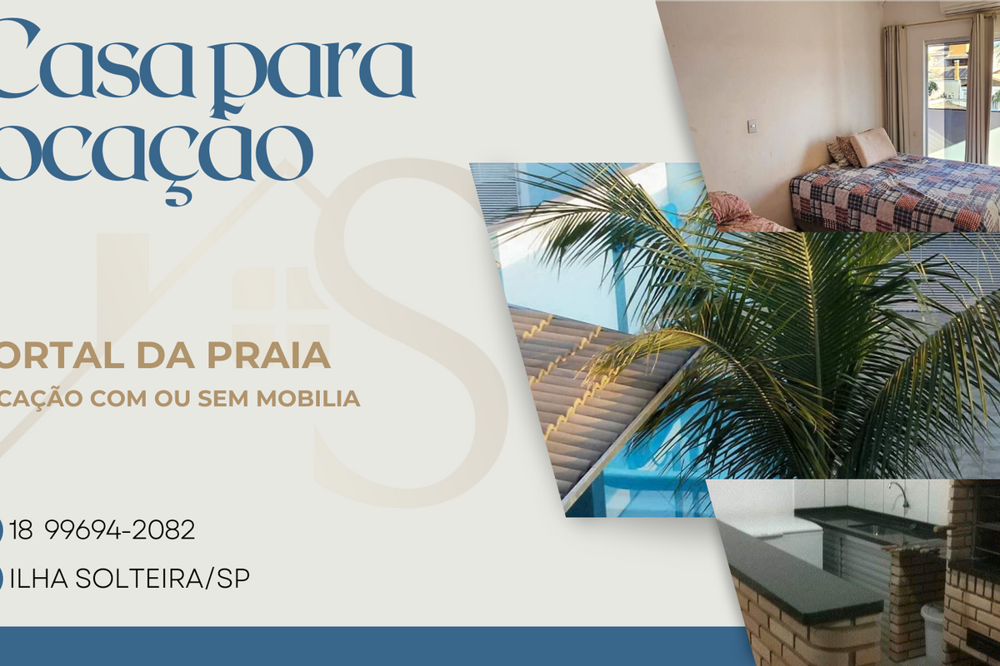

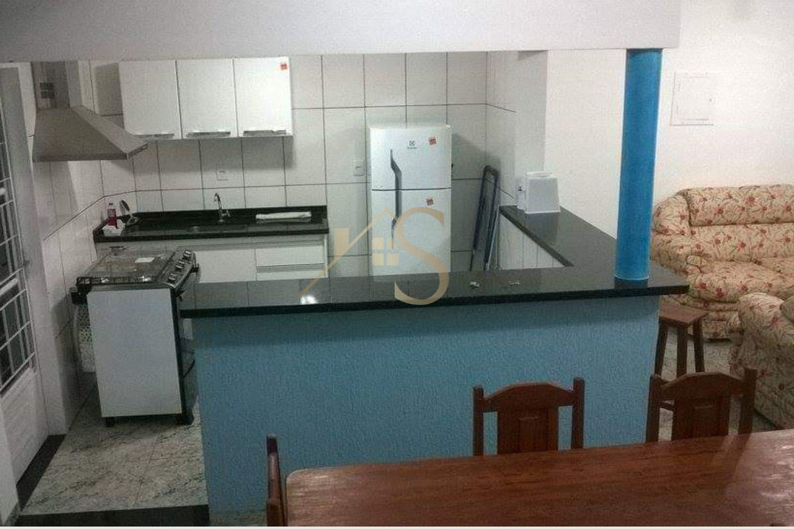

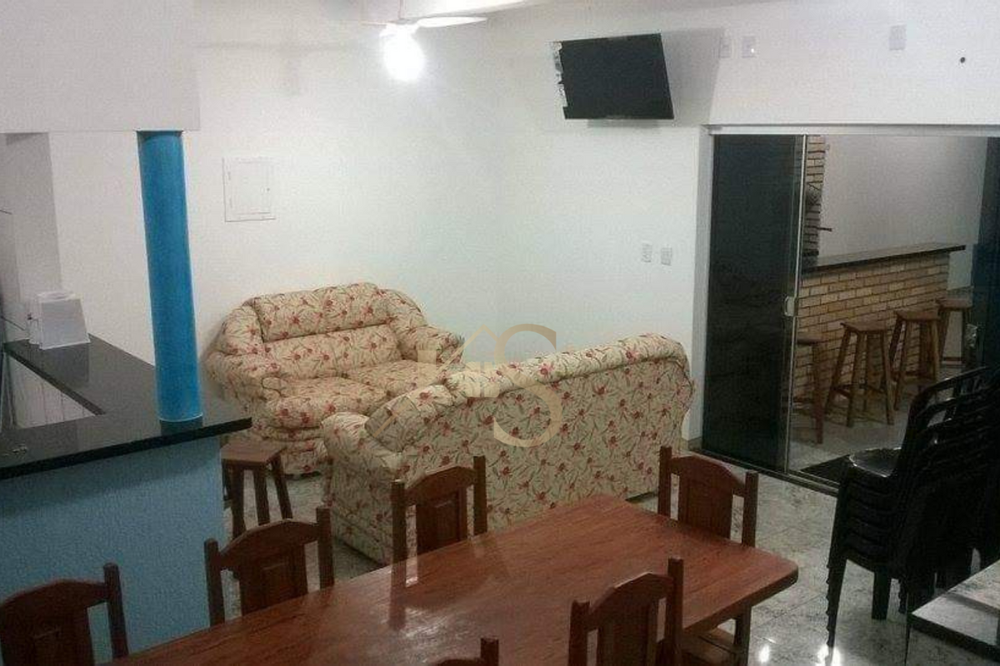

🔗 [Ver no site](https://imovel.sicadiweb.com.br/LOCACAO/DVI-IM-11D61A832EC24EA4A6032606BE066C31/IAC-IMOB-35AC99F2)

---

## 3. Casa 2 quartos para Locação Jardim Morada do Sol, Ilha Solteira

- **Código:** 00087
- **Tipo:** Casa | **Finalidade:** Aluguel
- **Valor:** R$ 1.000
- **Endereço:** Rua Cabreúva, 220, Jardim Morada do Sol - Ilha Solteira/SP
- **CEP:** 15386138
- **Composição:** 2 Quartos, 1 Banheiro, 1 Vaga, 1m²
- **Características:** Banheiro de serviço, Calçada, Cozinha, Quintal, Sala, Varanda

> - Sala
> - Cozinha, com armário planejado 
> - 2 Quartos
> - Banheiro 
> - Garagem para 1 carro 
> 

**📷 7 foto(s):**

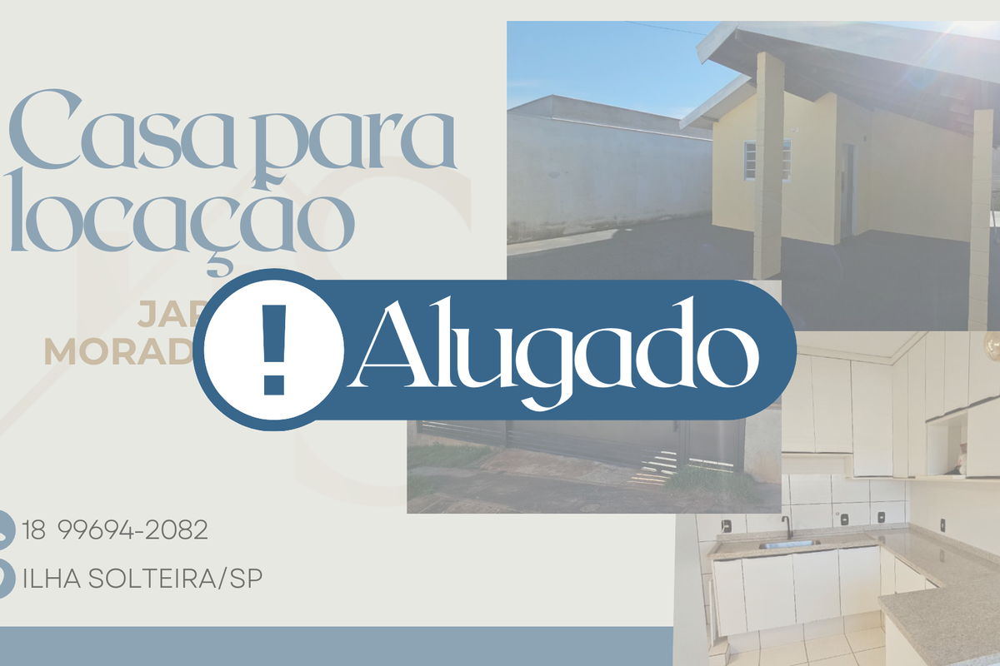

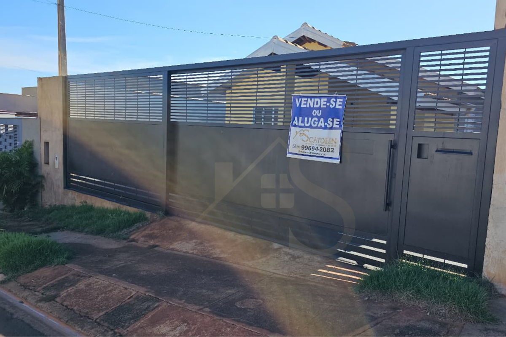

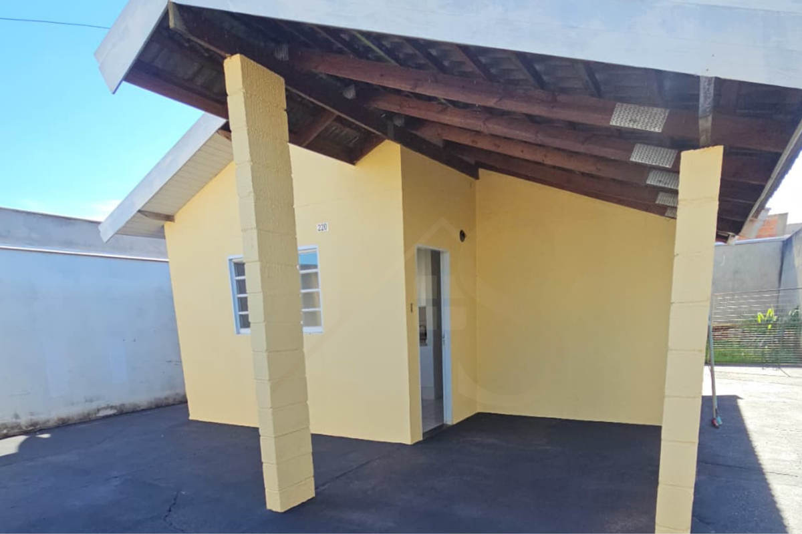

🔗 [Ver no site](https://imovel.sicadiweb.com.br/LOCACAO/DVI-IM-1C6E7CBE1F294E2C8A512076E988719F/IAC-IMOB-35AC99F2)

---

## 4. Casa para Locação Zona Sul, Ilha Solteira

- **Código:** 00092
- **Tipo:** Casa | **Finalidade:** Aluguel
- **Valor:** R$ 2.200
- **Endereço:** Passeio Sabará, 206, Zona Sul - Ilha Solteira/SP
- **CEP:** 15388060
- **Composição:** 4 Quartos (sendo 1 Suíte), 2 Banheiros, 3 Vagas, 1m²
- **Características:** Área de lazer, Banheiro da suíte, Churrasqueira, Closet, Corredor, Cozinha, Depósito, Quintal, Sala, Sala de jantar, Sala de TV

> Apresentamos um verdadeiro lar na Zona Sul de Ilha Solteira!
> 
> No Passeio Sabará, 206, você encontra uma casa ampla, confortável e perfeita para quem busca qualidade de vida.
> 
> São 4 quartos, incluindo um quarto integrado com closet e uma suíte espaçosa.
> 
> Além disso, a casa conta com 3 ambientes de sala, ideais para reunir a família, trabalhar ou relaxar.
> 
> A estrutura é completa: cozinha e sala de jantar integradas, lavanderia coberta, depósito, e uma charmosa área gourmet com chur

**📷 12 foto(s):**

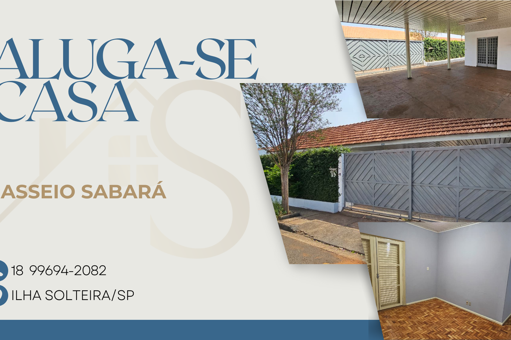

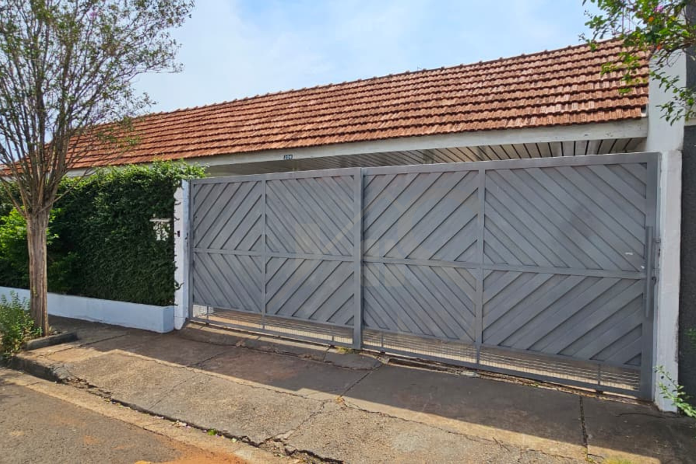

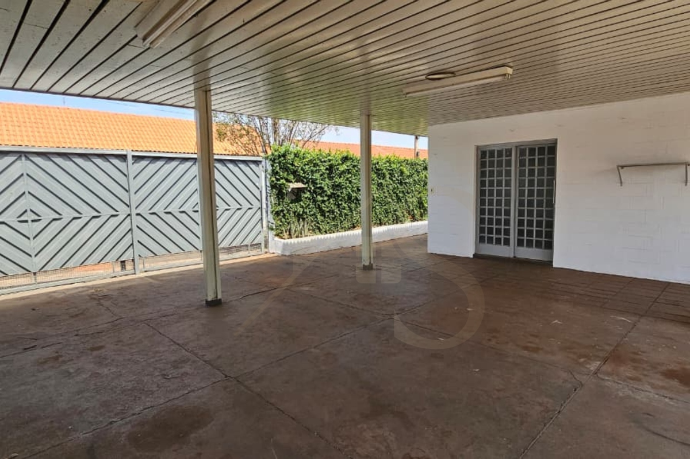

🔗 [Ver no site](https://imovel.sicadiweb.com.br/LOCACAO/DVI-IM-1D2D7F87EDCD49729326B9A530107B9A/IAC-IMOB-35AC99F2)

---

## 5. Rancho para Locação Recanto das Águas, Ilha Solteira

- **Código:** 00093
- **Tipo:** Chácara | **Finalidade:** Aluguel
- **Valor:** R$ 800
- **Endereço:** Avenida Doutor Itamar Gouveia, S/N, Recanto das Águas - Ilha Solteira/SP
- **CEP:** 15386200
- **Composição:** 4 Quartos, 4 Banheiros, 10 Vagas, 1m²
- **Características:** Área de lazer, Banheiro área de lazer, Calçada, Churrasqueira, Cozinha, Corredor, Jardim, Piscina, Quintal, Sala, Sala de jantar, Sala de jogos, Sala de TV

> ALUGA-SE RANCHO COMPLETO – TEMPORADA / FINAL DE SEMANA 
> 
> O refúgio perfeito para descansar, celebrar e curtir a natureza!
> 
> O rancho oferece:
> – Área de 3.650 m² com muito verde e fundos para o rio
> – Estacionamento interno
> – Wi-Fi 300 Mb
> – Piscina de alto padrão com prainha + piscina infantil
> – Área gourmet completa: freezer, geladeira, fogão industrial, pia dupla, churrasqueira e utensílios
> – 2 casas com total de 4 quartos climatizados (cama de casal e solteiro) + ventiladores

**📷 12 foto(s):**

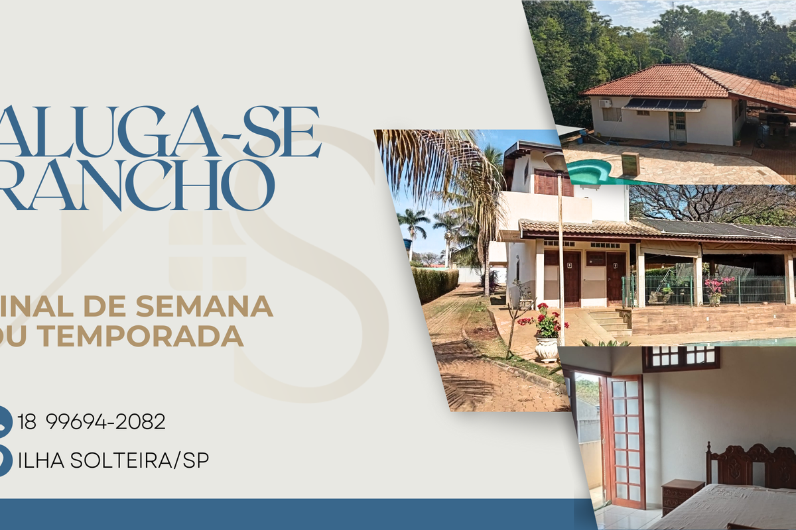

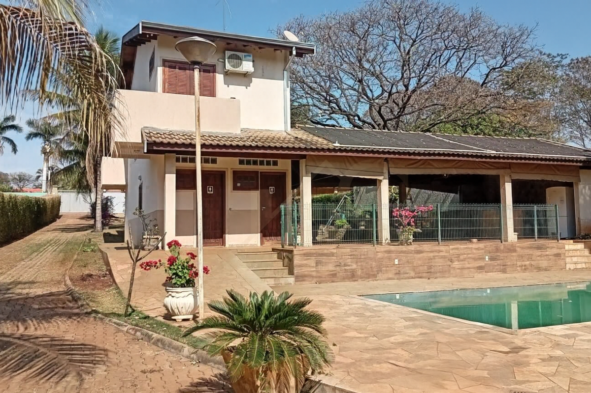

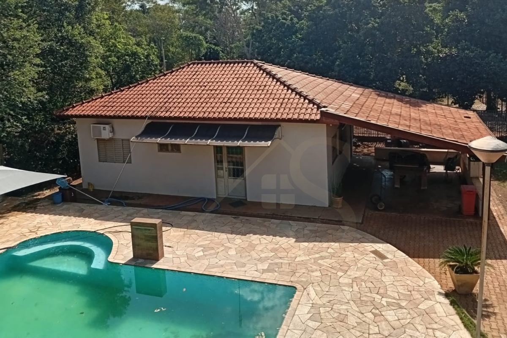

🔗 [Ver no site](https://imovel.sicadiweb.com.br/LOCACAO/DVI-IM-20C8B77240044DD6A0DEBF07E878CE81/IAC-IMOB-35AC99F2)

---

## 6. Apartamento Mobiliado de 2 Quartos - Conforto e Praticidade no Seu Novo Lar

- **Código:** 00012
- **Tipo:** Apartamento | **Finalidade:** Aluguel
- **Valor:** R$ 2.500
- **Endereço:** Avenida Atlântica, 1690, Centro - Ilha Solteira/SP
- **CEP:** 15385001
- **Composição:** 2 Quartos, 1 Banheiro, 1 Vaga, 1m²
- **Condomínio:** [object Object] (Aberto)

> Este lindo apartamento, totalmente mobiliado, é a opção ideal para quem busca praticidade, conforto e um ambiente moderno. Localizado em uma das regiões mais desejadas da cidade, oferece fácil acesso a transportes, comércio e serviços essenciais.
> Este apartamento é perfeito para quem busca um espaço confortável, bem localizado e pronto para morar, fica em frente a rodoviária, supermercado Proença e Shopping.

**📷 5 foto(s):**

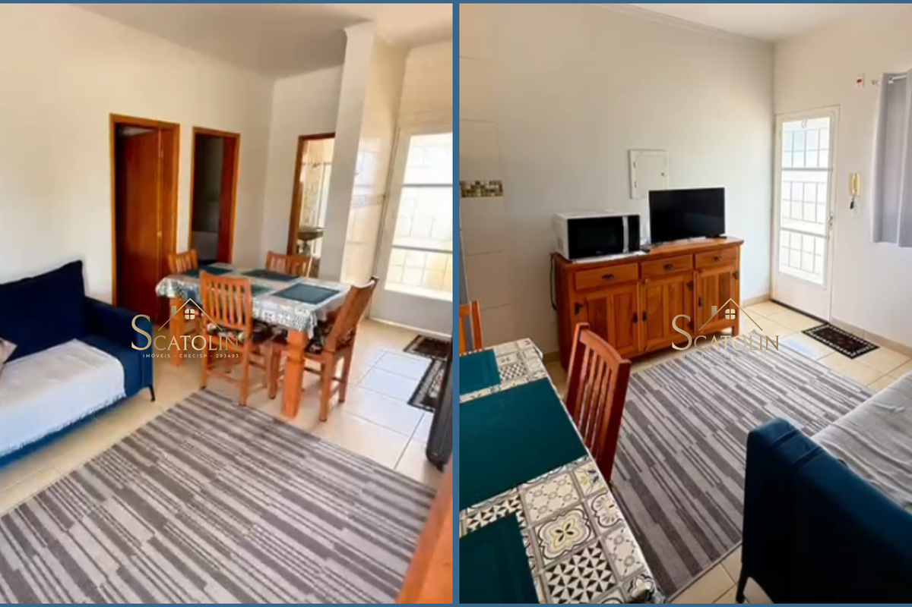

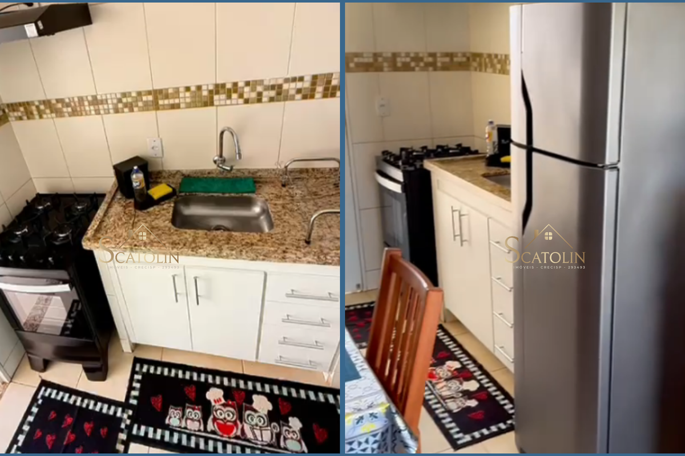

🔗 [Ver no site](https://imovel.sicadiweb.com.br/LOCACAO/DVI-IM-35163C55D80042A5BB34C68CC70DB21D/IAC-IMOB-35AC99F2)

---

## 7. Apartamento para locação na Rua Nazaré, 170.

- **Código:** 00035
- **Tipo:** Apartamento | **Finalidade:** Aluguel
- **Valor:** R$ 950
- **Endereço:** Rua Nazaré, 170, Zona Norte - Ilha Solteira/SP
- **CEP:** 15385162
- **Composição:** 2 Quartos, 1 Banheiro, 1 Vaga, 1m²
- **Condomínio:** [object Object] (Aberto)

> Excelente apartamento para locação, ideal para quem busca praticidade e conforto! Localizado em uma região privilegiada, a poucos minutos do centro da cidade e da UNESP Central, oferecendo fácil acesso a serviços, comércio e transporte público. O imóvel está em ótimo estado de conservação e pronto para morar. Não perca a oportunidade de morar em um local estratégico e de fácil acesso a tudo que você precisa! Agende sua visita e venha conhecer!
> 
> R$ 1050,00, bonificação de R$100,00 se pago até

**📷 5 foto(s):**

🔗 [Ver no site](https://imovel.sicadiweb.com.br/LOCACAO/DVI-IM-36BD0BD6963549618A537AEE9F92C0F6/IAC-IMOB-35AC99F2)

---

## 8. Casa 4 quartos para Locação Zona Norte, Ilha Solteira

- **Código:** 00053
- **Tipo:** Casa | **Finalidade:** Aluguel
- **Valor:** R$ 1.300
- **Endereço:** Passeio Manaus, 305, Zona Norte - Ilha Solteira/SP
- **CEP:** 15385282
- **Composição:** 4 Quartos, 2 Banheiros, 2 Vagas, 1m²
- **Características:** Corredor, Cozinha, Quintal, Sala

> Que tal morar em uma casa espaçosa, confortável e super bem localizada no Passeio Manaus? 
> 
> 4 dormitórios para acomodar toda a família
> Sala ampla para momentos inesquecíveis
> Área com churrasqueira para seus finais de semana serem ainda melhores
> Garagem e fácil acesso a comércios, escolas e serviços
> 
> Tudo isso por apenas R$ 1.300,00/mês! 
> 
> Não perca essa oportunidade! Entre em contato e agende uma visita. 

**📷 8 foto(s):**

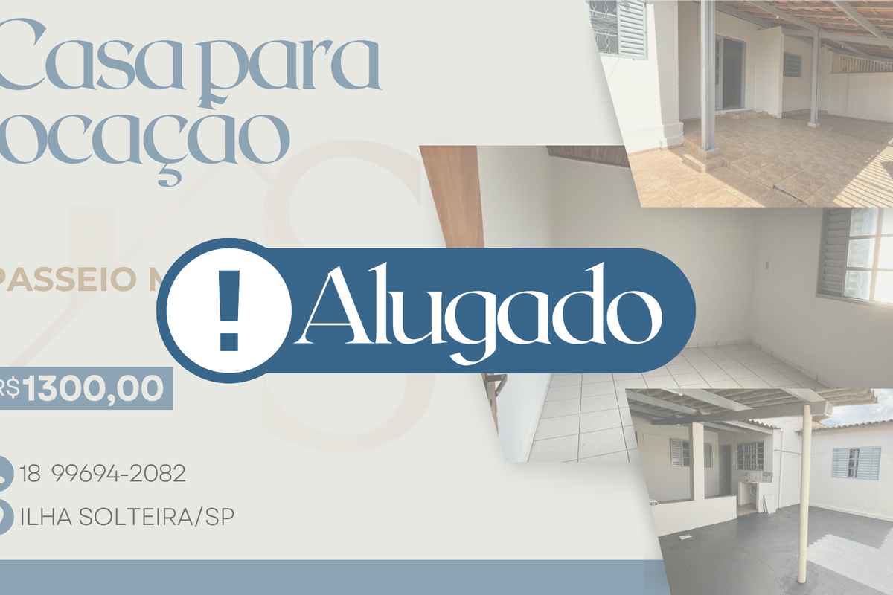

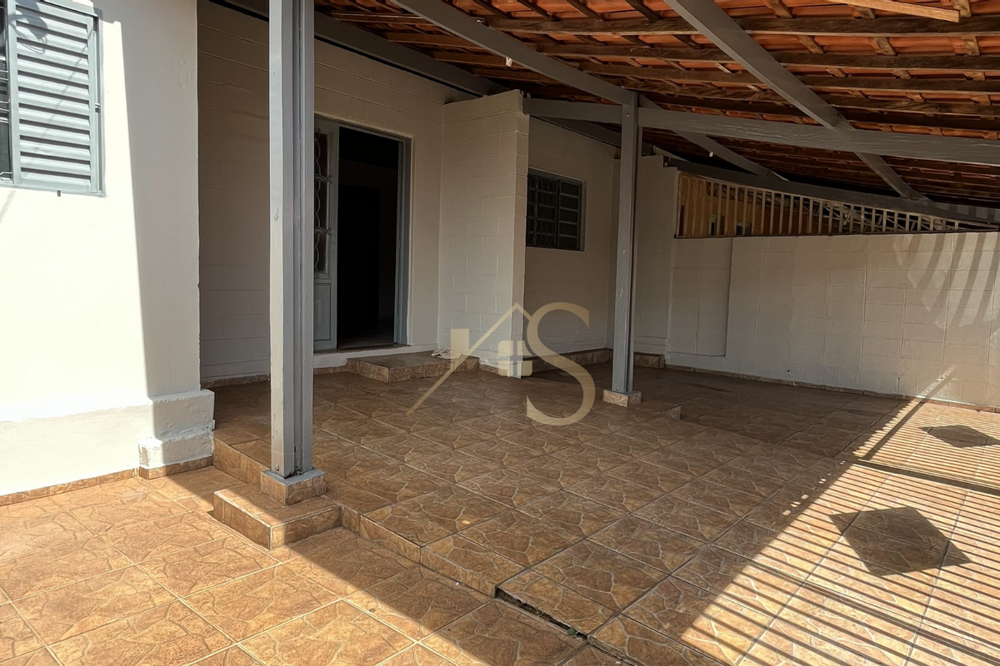

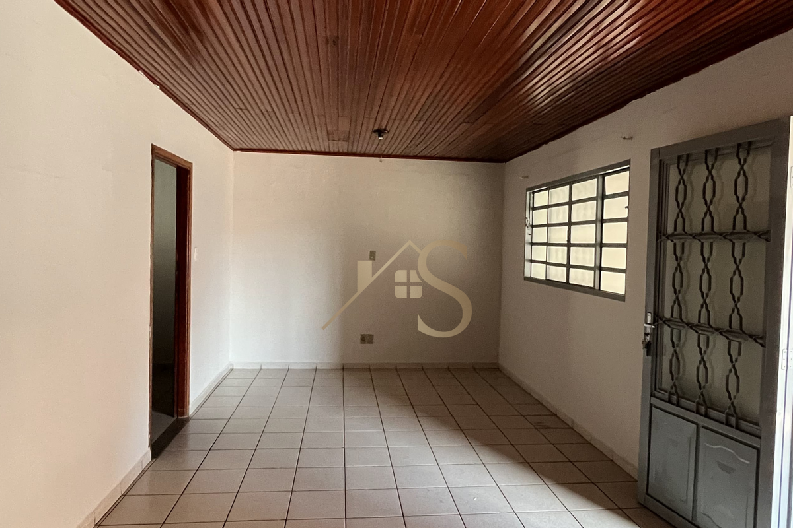

🔗 [Ver no site](https://imovel.sicadiweb.com.br/LOCACAO/DVI-IM-38D6B6868AF242C4B87C65CE75C97314/IAC-IMOB-35AC99F2)

---

## 9.  BARRACÃO DISPONÍVEL – LOCAÇÃO OU VENDA!

- **Código:** 00064
- **Tipo:** Galpão | **Finalidade:** Aluguel
- **Valor:** R$ 153.870,02
- **Endereço:** Avenida 15 de Novembro, 1135, Jardim Aeroporto - Ilha Solteira/SP
- **CEP:** 15387002
- **Composição:** 1m²

>  BARRACÃO DISPONÍVEL – LOCAÇÃO OU VENDA!
> 
> Está disponível para venda ou locação este barracão localizado em ponto estratégico da cidade, na Avenida 15 de Novembro, nº 1135 – região de fácil acesso, ideal para empresas que buscam visibilidade, estrutura e funcionalidade.
> 
> À VENDA por R$ 900.000,00
> Para LOCAÇÃO: R$ 4.000,00/mês
> 
> Este imóvel é ideal para empresas dos setores industrial, logístico, comercial ou prestadores de serviço que buscam um espaço bem localizado, funcional e com

**📷 4 foto(s):**

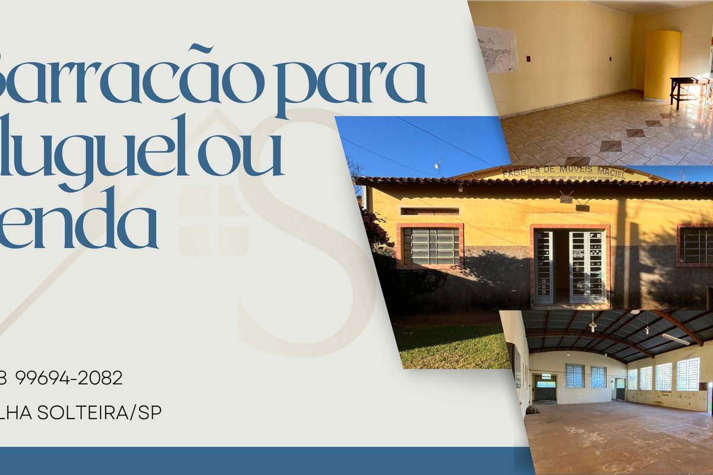

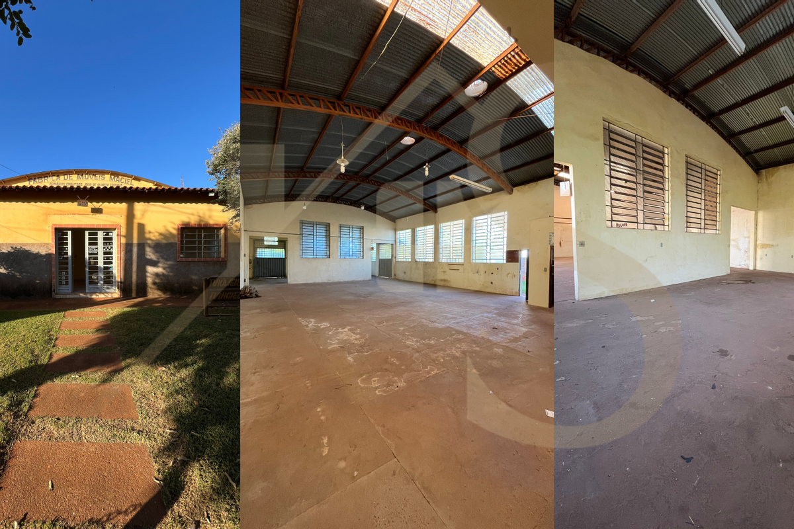

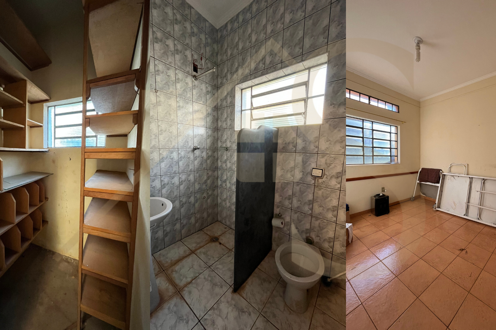

🔗 [Ver no site](https://imovel.sicadiweb.com.br/LOCACAO/DVI-IM-3DB3D6186DD94952ABCF0F7C6D505D4D/IAC-IMOB-35AC99F2)

---

## 10. Casa 3 quartos para Locação Zona Norte, Ilha Solteira

- **Código:** 00101
- **Tipo:** Casa | **Finalidade:** Aluguel
- **Valor:** R$ 1.800
- **Endereço:** Passeio Juazeiro, 217, Zona Norte - Ilha Solteira/SP
- **CEP:** 15385156
- **Composição:** 3 Quartos, 1 Banheiro, 3 Vagas, 1m²
- **Características:** Cozinha, Edícula, Sala, Sala de jantar

> Já pensou em morar bem, ao lado do Centro e perto de tudo?
> 
> Então para tudo, porque o imóvel ideal pra você acabou de aparecer 
> 
> Casa mobiliada, pronta pra morar, com conforto e praticidade no dia a dia:
> 
> -Garagem para até 3 carros
> -Sala
> -3 quartos
> -Sala de jantar
> -Cozinha
> -Banheiro
> - Área no fundo
> - Possui Placa solar, economia de R$600,00 em energia.

**📷 11 foto(s):**

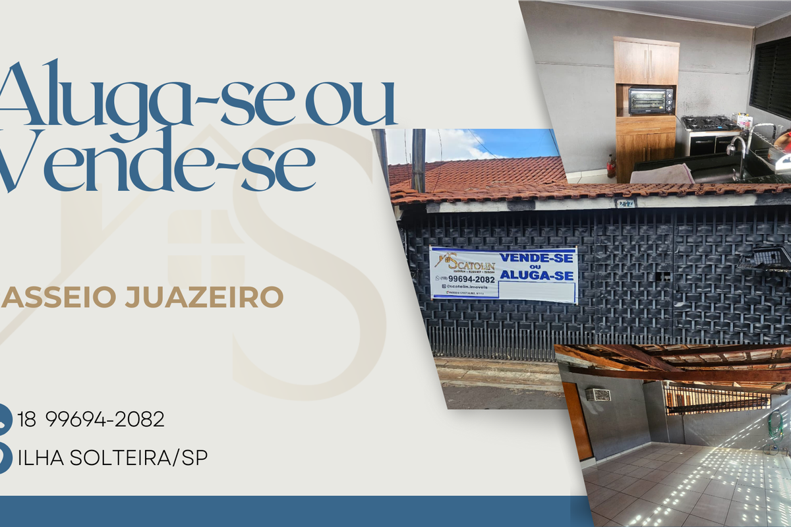

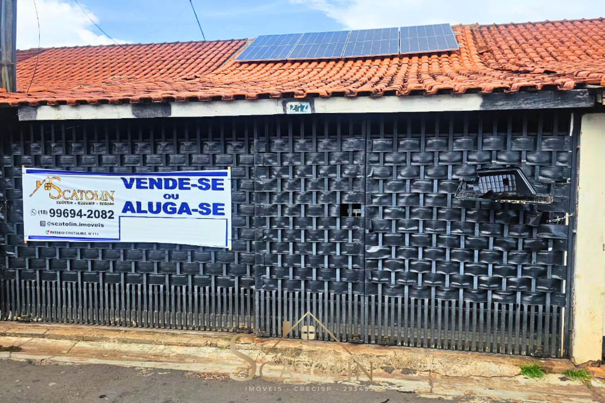

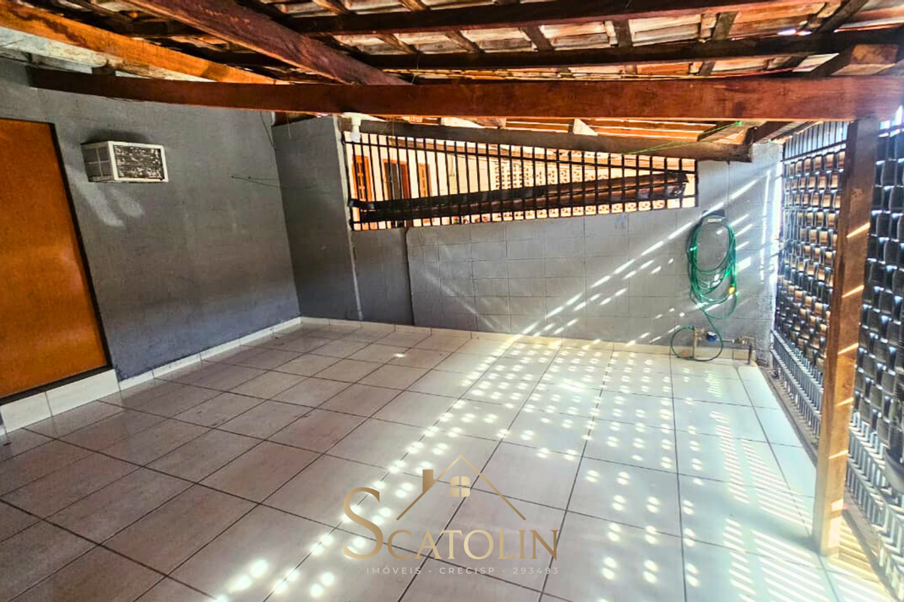

🔗 [Ver no site](https://imovel.sicadiweb.com.br/LOCACAO/DVI-IM-5350A30E2990484CB9E4103EE1FE467B/IAC-IMOB-35AC99F2)

---

## 11. Casa 2 quartos para Locação Jardim Ilha do Sol, Ilha Solteira

- **Código:** 00065
- **Tipo:** Casa | **Finalidade:** Aluguel
- **Valor:** R$ 850
- **Endereço:** Rua Rachel de Queiroz, 785, Jardim Ilha do Sol - Ilha Solteira/SP
- **CEP:** 15387224
- **Composição:** 2 Quartos, 1 Banheiro, 1 Vaga, 1m²
- **Características:** Sala, Corredor, Cozinha, Calçada

> Casa com 2 quartos para locação no Jardim Ilha do Sol, Ilha Solteira.
> Uma excelente opção para quem busca conforto, em ótima localização!

**📷 7 foto(s):**

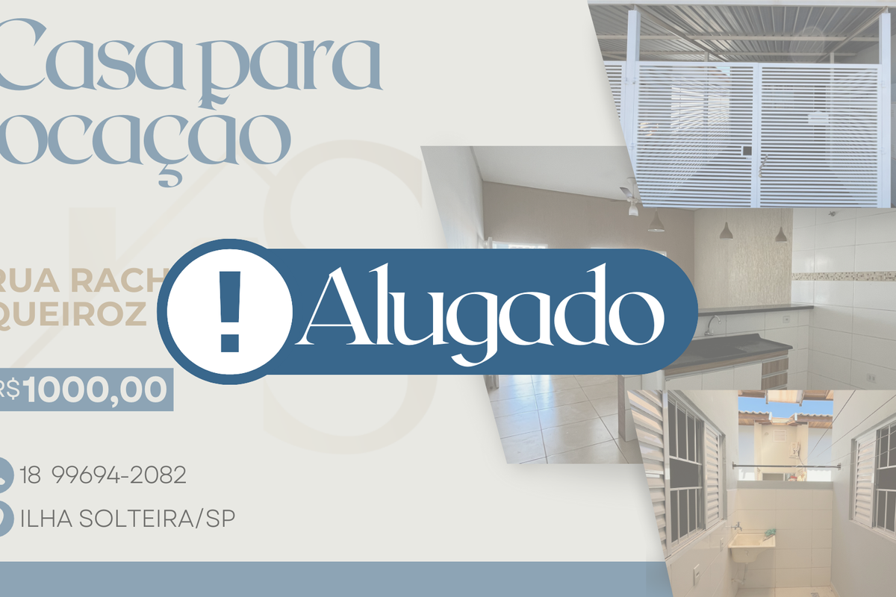

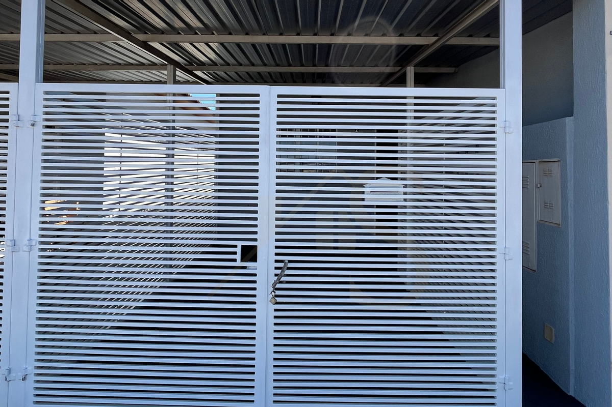

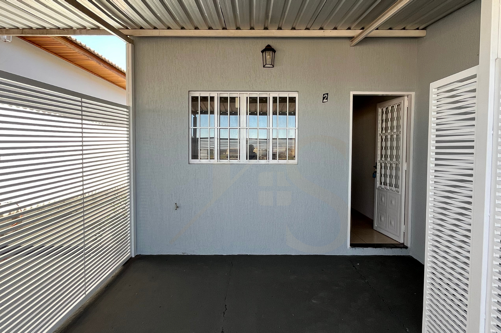

🔗 [Ver no site](https://imovel.sicadiweb.com.br/LOCACAO/DVI-IM-6075FB89F9CE4AF9851B0A960AC2398A/IAC-IMOB-35AC99F2)

---

## 12. Apartamento 2 quartos para Locação Zona Norte, Ilha Solteira

- **Código:** 00076
- **Tipo:** Apartamento | **Finalidade:** Aluguel
- **Valor:** R$ 950
- **Endereço:** Passeio Nazaré, 108, Zona Norte - Ilha Solteira/SP
- **CEP:** 15385164
- **Composição:** 2 Quartos, 1 Banheiro, 1 Vaga, 1m²
- **Características:** Corredor, Cozinha, Sala
- **Condomínio:** [object Object] (Aberto)

> Apartamento para locação
> 
> Rua Nazaré, 108 – 2º andar
> Próximo ao Centro e à UNESP Central
> 
> ->2 quartos
> ->1 banheiro
> ->Sala
> ->Cozinha
> ->Lavanderia
> ->1 vaga de garagem coberta
> 
> Local tranquilo e bem localizado, ideal para estudantes ou famílias.
> 
> Interessados, entrar em contato pelo WhatsApp: (18) 99694-2082

**📷 4 foto(s):**

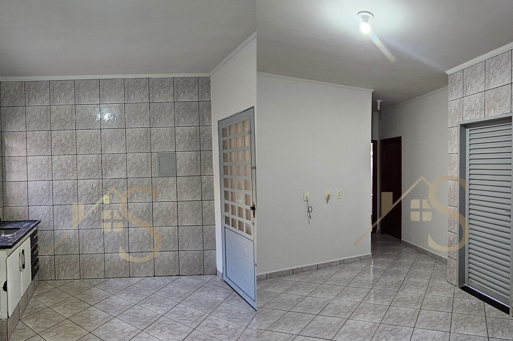

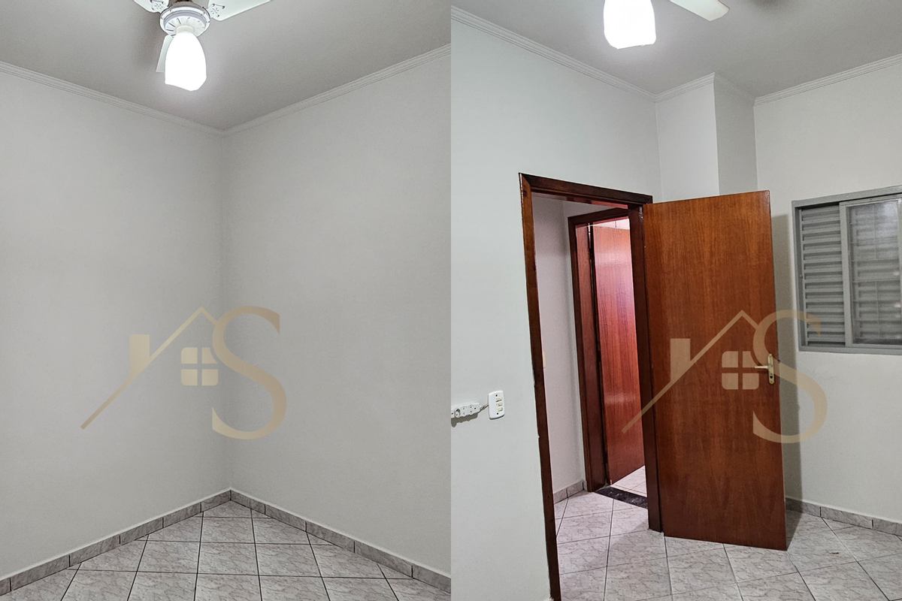

🔗 [Ver no site](https://imovel.sicadiweb.com.br/LOCACAO/DVI-IM-6A7E38D8AB594DEA95E4DC5BE37815F5/IAC-IMOB-35AC99F2)

---

## 13. Casa 2 quartos para Locação Jardim Ilha do Sol, Ilha Solteira

- **Código:** 00057
- **Tipo:** Casa | **Finalidade:** Aluguel
- **Valor:** R$ 2.000
- **Endereço:** Rua Euclides da Cunha, 564, Jardim Ilha do Sol - Ilha Solteira/SP
- **CEP:** 15387202
- **Composição:** 2 Quartos, 1 Banheiro, 2 Vagas, 1m²
- **Características:** Calçada, Cozinha, Corredor, Quintal, Sala

> Casa Encantadora para locação – Exclusividade Scatolin Imóveis!
> O lar que você procura está aqui! Essa charmosa residência une conforto, praticidade e um ótimo espaço para você e sua família viverem com qualidade!
> 
> Destaques desta oportunidade especial:
> 2 quartos – Ambientes confortáveis para o seu descanso diário!
> Sala acolhedora – Ideal para curtir bons momentos com quem você ama!
> Cozinha prática e funcional – Tudo na medida certa para suas receitas favoritas!
> Quintal amplo – Um 

**📷 10 foto(s):**

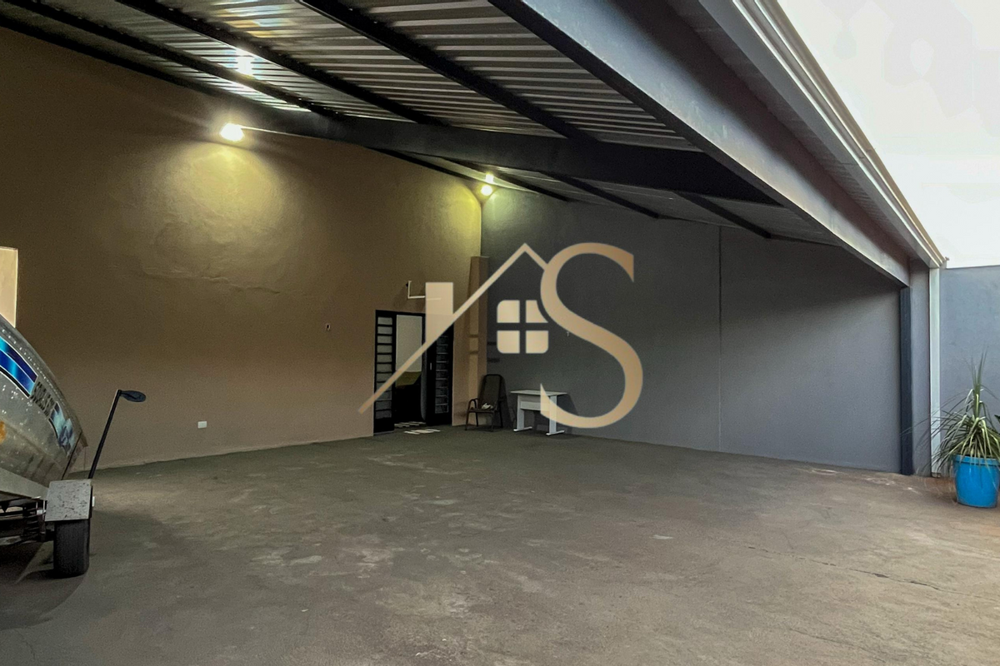

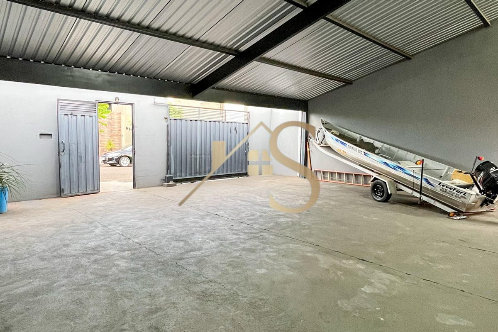

🔗 [Ver no site](https://imovel.sicadiweb.com.br/LOCACAO/DVI-IM-6D2172D999744168A3A29F66B88C83BA/IAC-IMOB-35AC99F2)

---

## 14. Casa 3 quartos para Locação Jardim Ilha do Sol, Ilha Solteira

- **Código:** 00074
- **Tipo:** Casa | **Finalidade:** Aluguel
- **Valor:** R$ 2.500
- **Endereço:** Rua Rachel de Queiroz, 318, Jardim Ilha do Sol - Ilha Solteira/SP
- **CEP:** 15387224
- **Composição:** 3 Quartos (sendo 1 Suíte), 2 Banheiros, 2 Vagas, 1m²
- **Características:** Calçada, Corredor, Cozinha, Quintal, Sala, Sala de jantar

> Se você busca um lar espaçoso, moderno e cheio de estilo, essa é a oportunidade perfeita para você e sua família viverem com conforto, segurança e qualidade de vida!
> 
> Confira os diferenciais desse imóvel incrível:
> 
> -> Garagem para 2 carros
> -> Portão basculante com design moderno e interfone
> -> Sala de estar ampla e bem iluminada
> -> Jardim de inverno
> -> Sala de jantar com armários planejados
> -> Cozinha completa com móveis planejados, fogão cooktop embutido e depurador Suggar
> -

**📷 11 foto(s):**

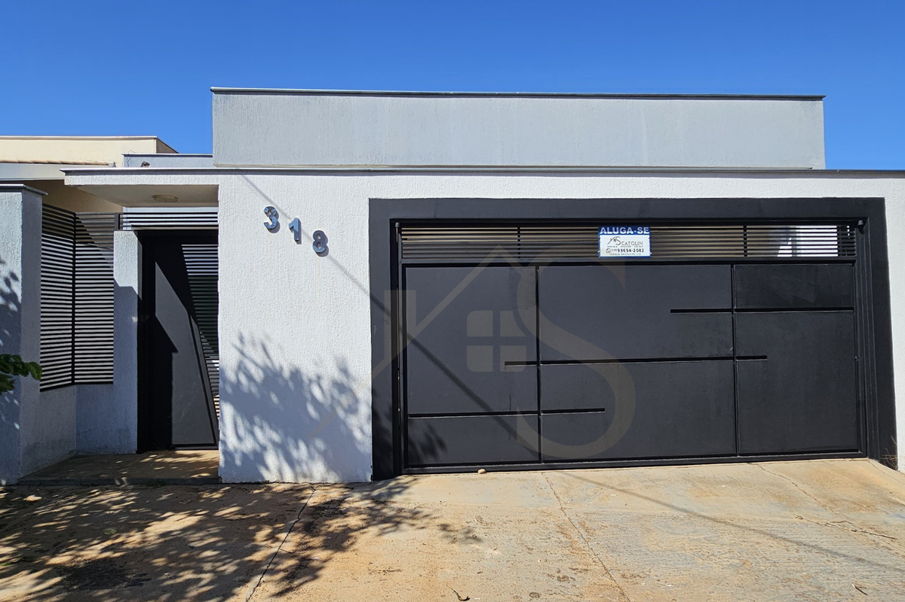

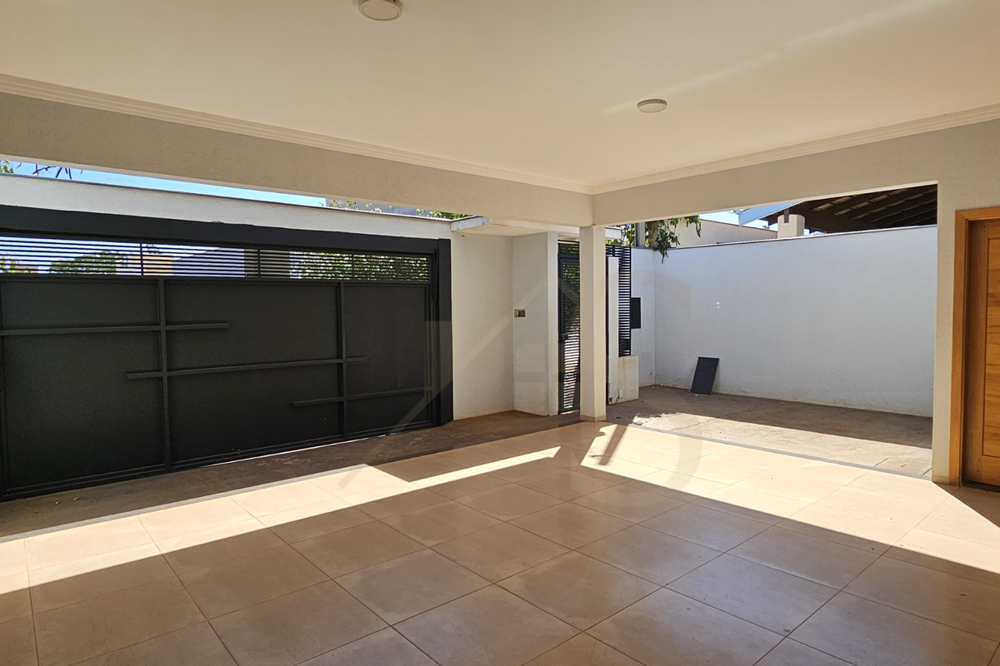

🔗 [Ver no site](https://imovel.sicadiweb.com.br/LOCACAO/DVI-IM-721D4CF8504941929E7EF9D9D7D4F202/IAC-IMOB-35AC99F2)

---

## 15. Apartamento para locação na Rua Nazaré, 170.

- **Código:** 00011
- **Tipo:** Apartamento | **Finalidade:** Aluguel
- **Valor:** R$ 1.200
- **Endereço:** Rua Nazaré, 170, Zona Norte - Ilha Solteira/SP
- **CEP:** 15385162
- **Composição:** 2 Quartos, 1 Banheiro, 1 Vaga, 1m²
- **Condomínio:** [object Object] (Aberto)

> Excelente apartamento para locação, ideal para quem busca praticidade e conforto! Localizado em uma região privilegiada, a poucos minutos do centro da cidade e da UNESP Central, oferecendo fácil acesso a serviços, comércio e transporte público. O imóvel está em ótimo estado de conservação e pronto para morar. Não perca a oportunidade de morar em um local estratégico e de fácil acesso a tudo que você precisa! Agende sua visita e venha conhecer!

**📷 7 foto(s):**

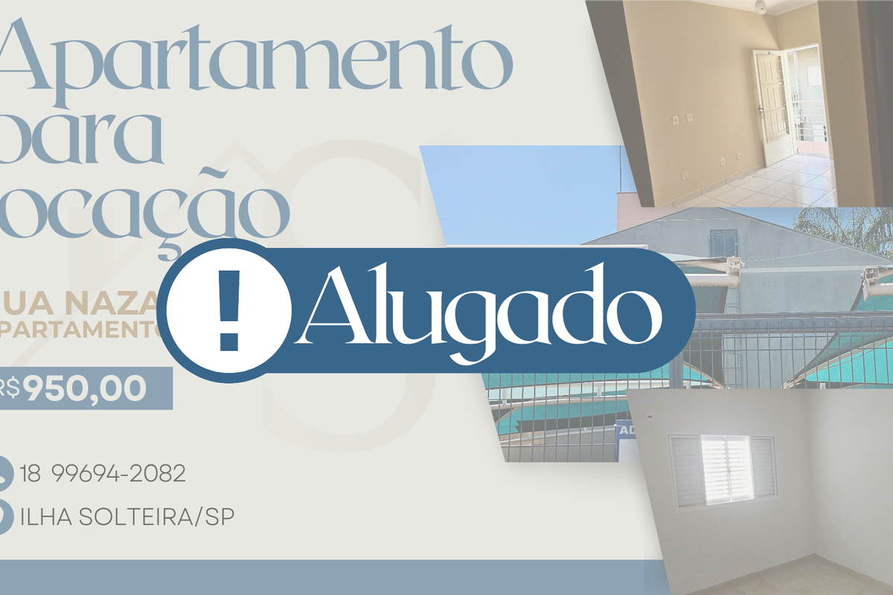

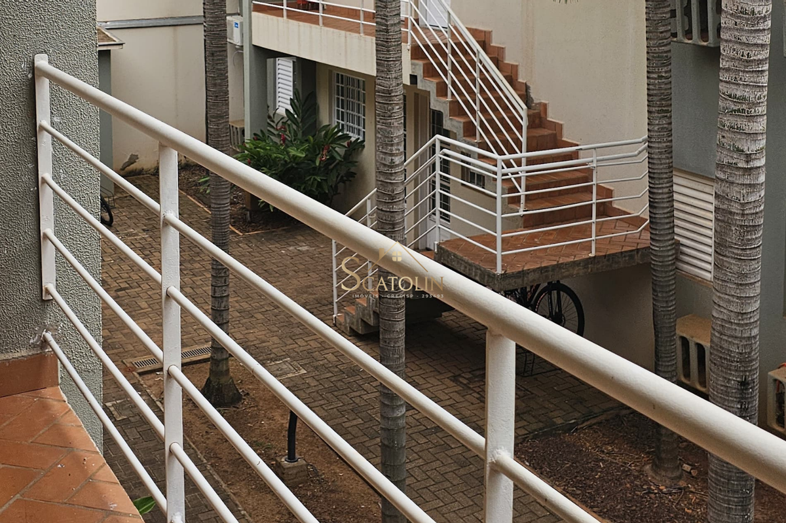

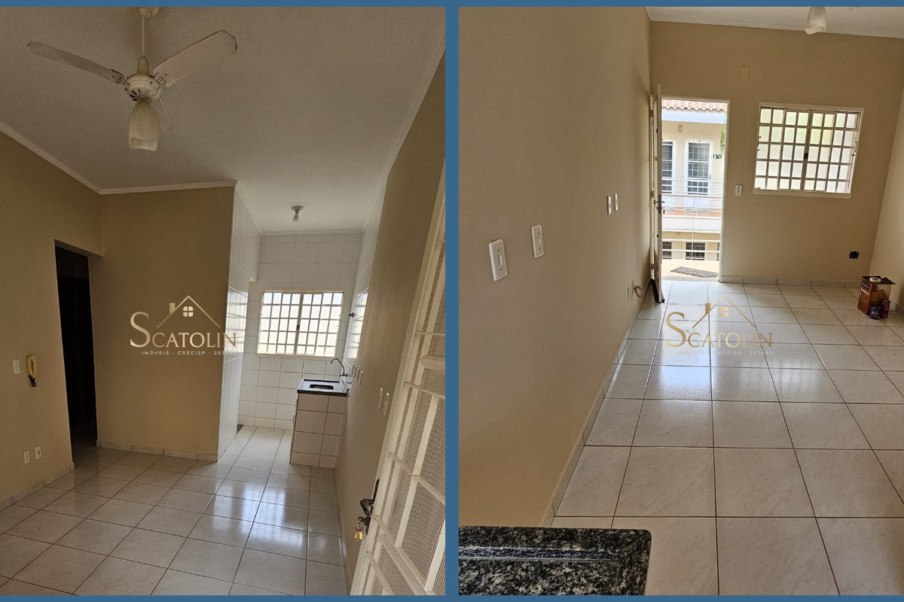

🔗 [Ver no site](https://imovel.sicadiweb.com.br/LOCACAO/DVI-IM-75B954E1E8B748DC953D389252152640/IAC-IMOB-35AC99F2)

---

## 16. Rancho Marinheiro – O refúgio dos seus sonhos no Portal da Praia!

- **Código:** 00063
- **Tipo:** Casa | **Finalidade:** Aluguel
- **Valor:** R$ 7.000
- **Endereço:** Avenida Praia de Copacabana, 138, Portal da Praia - Ilha Solteira/SP
- **CEP:** 15386012
- **Composição:** 10 Quartos (sendo 2 Suítes), 2 Banheiros, 1m²

> Av. Praia de Copacabana, 138
> 
> Disponível para locação mensal
> 
> Prepare-se para se encantar com cada detalhe deste imóvel exclusivo! São 10 quartos, incluindo duas suítes, uma delas com uma vista deslumbrante para o rio.
> 
> Duas áreas gourmet, cinco banheiros, um incrível spa de hidromassagem e uma piscina perfeita para os dias de sol.
> 
> Diversão garantida com um mini playground com casinha na árvore, areia e escorregador. Tudo isso cercado por uma ampla área verde, com dois pergolado

**📷 6 foto(s):**

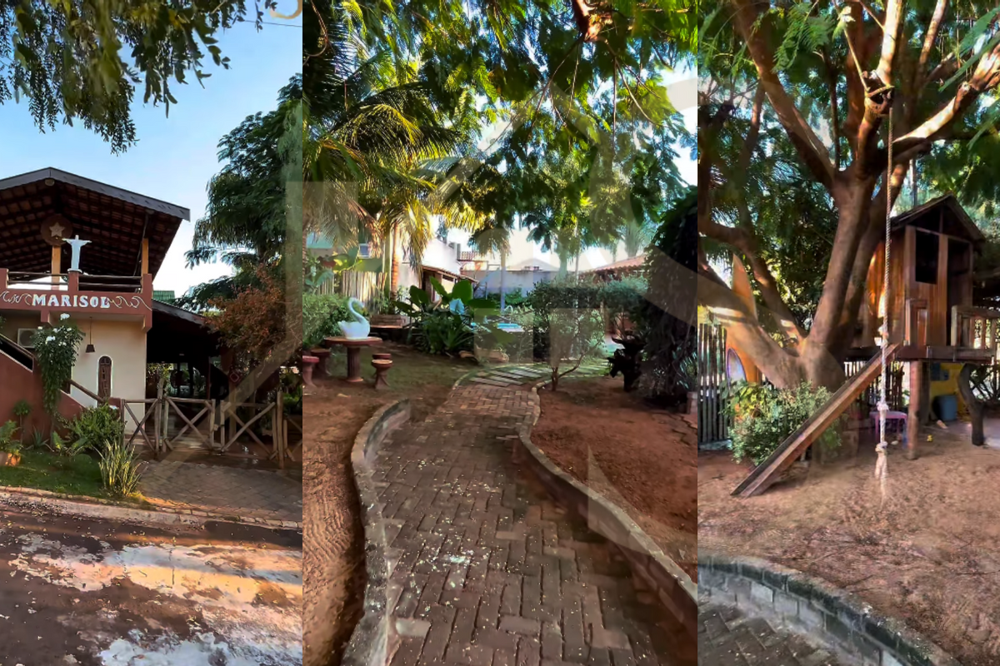

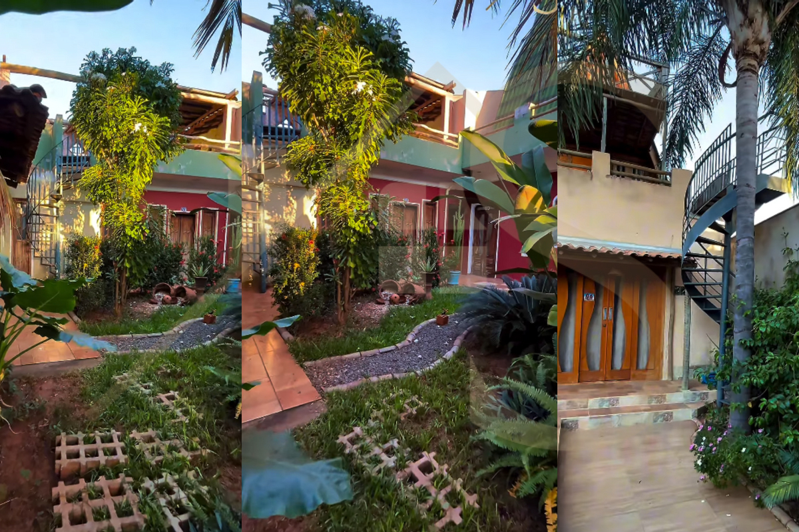

🔗 [Ver no site](https://imovel.sicadiweb.com.br/LOCACAO/DVI-IM-80E0193496A94632BCED3F4507EB4392/IAC-IMOB-35AC99F2)

---

## 17. Apartamento para Aluguel – Localização Privilegiada

- **Código:** 00033
- **Tipo:** Apartamento | **Finalidade:** Aluguel
- **Valor:** R$ 1.300
- **Endereço:** Avenida Atlântica, 1690, Centro - Ilha Solteira/SP
- **CEP:** 15385001
- **Composição:** 2 Quartos, 1 Banheiro, 1 Vaga, 1m²
- **Características:** Corredor, Cozinha, Quintal, Sala
- **Condomínio:** [object Object] (Aberto)

> Próximo à Rodoviária, Shopping e Mercado Proença. Conforto, praticidade e tudo pertinho de você!
> 
> 2 quartos com ar-condicionado
> Sala ampla e aconchegante
> Cozinha 
> Banheiro
> 1 vaga de garagem
> Lavanderia
> Quintal privativo
> 
> Valor do aluguel: R$ 1.400,00
> Desconto de R$ 100,00 para pagamentos até o dia 10, ficando R$ 1.300,00.
> 
> Esse apartamento é perfeito para quem busca um espaço confortável, bem localizado e com fácil acesso a serviços essenciais.
> 
> Entre em contato e ag

**📷 6 foto(s):**

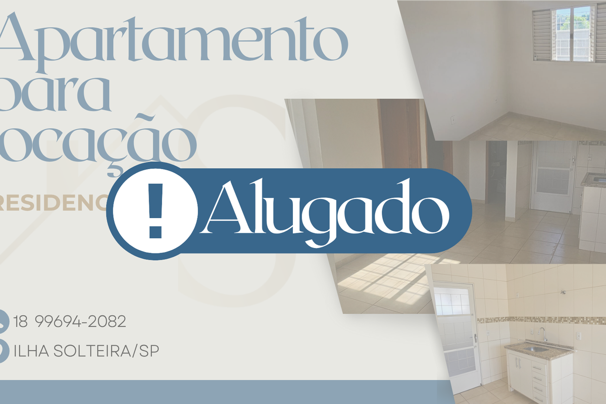

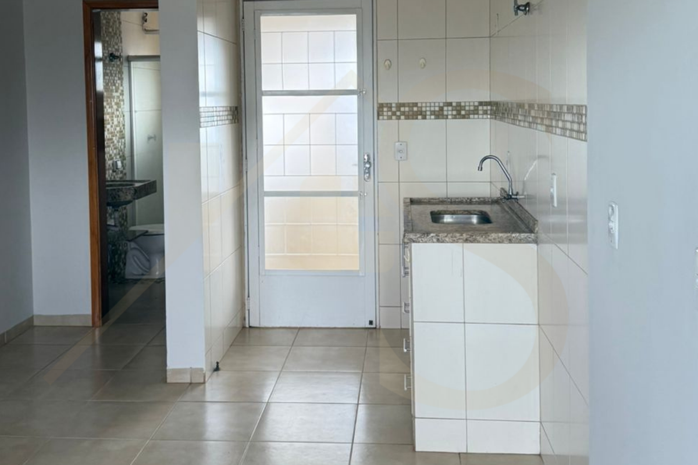

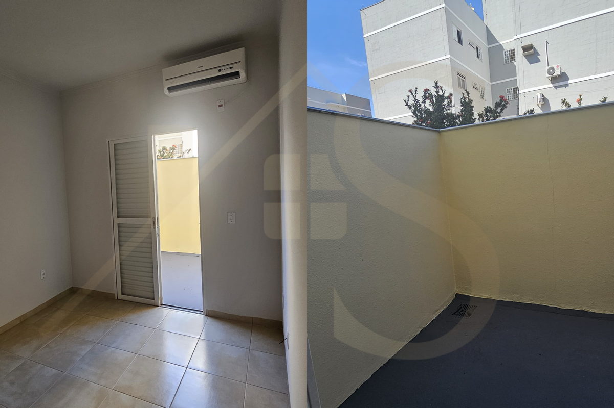

🔗 [Ver no site](https://imovel.sicadiweb.com.br/LOCACAO/DVI-IM-8BBA094CE11A44DF977F593804189683/IAC-IMOB-35AC99F2)

---

## 18. Casa para Locação – Conforto e Praticidade

- **Código:** 00027
- **Tipo:** Casa | **Finalidade:** Aluguel
- **Valor:** R$ 2.500
- **Endereço:** Rua Olavo Bilac, 592, Residencial Nova Ilha - Ilha Solteira/SP
- **CEP:** 15387158
- **Composição:** 1m²
- **Características:** Banheiro da suíte, Área de serviço, Corredor, Cozinha, Jardim de inverno, Quintal, Sala, Sala de jantar, Sala de TV

> Alugue essa incrível casa e viva com conforto e comodidade!
> 
> > Quartos com suítes
> > Banheiros
> > Cozinha Funcional
> > Móveis Planejados nos Quartos
> > Área de Churrasqueira para momentos de lazer
> > Lavanderia
> 
> Aluguel: R$ 2.700,00
> R$ 2.500,00 para pagamento até o dia 10
> 
> Localização excelente, em um bairro tranquilo e de fácil acesso!
> 
> | Entre em contato para mais informações e agende uma visita! 

**📷 18 foto(s):**

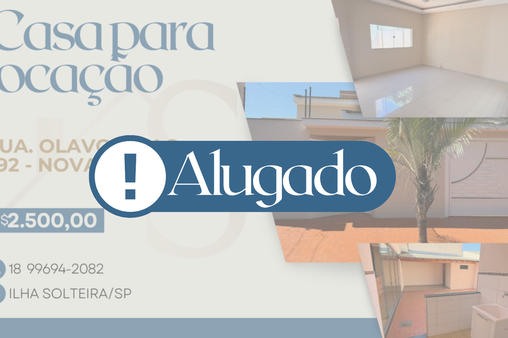

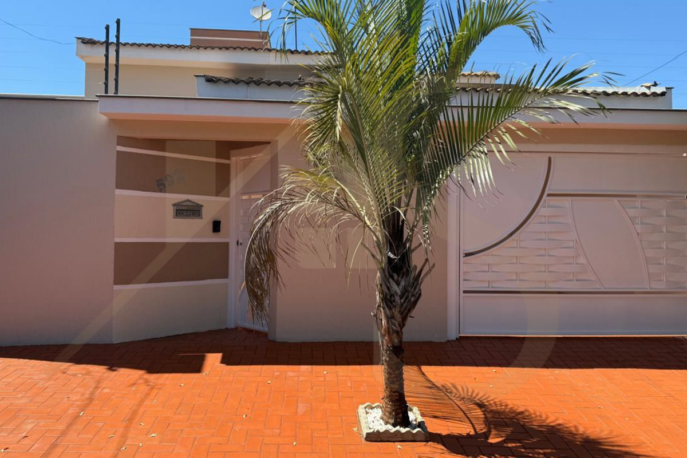

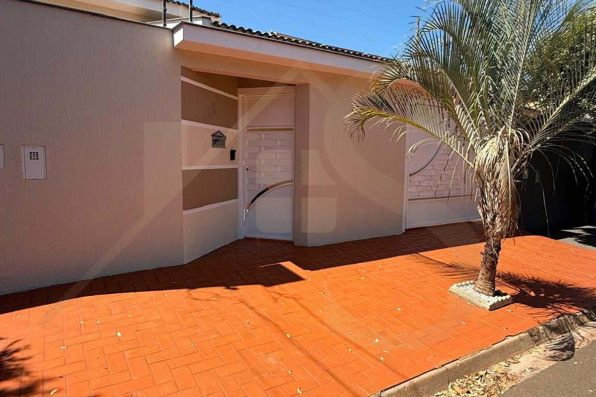

🔗 [Ver no site](https://imovel.sicadiweb.com.br/LOCACAO/DVI-IM-8ECD163DB5064B38BF0A22A3647B2EF5/IAC-IMOB-35AC99F2)

---

## 19. Apartamento para locação - térreo

- **Código:** 0081
- **Tipo:** Apartamento | **Finalidade:** Aluguel
- **Valor:** R$ 1.100
- **Endereço:** Rua Jataí, 125, Jardim das Paineiras - Ilha Solteira/SP
- **CEP:** 15385044
- **Composição:** 2 Quartos, 1 Banheiro, 1 Vaga, 1m²
- **Características:** Calçada, Cozinha, Sala
- **Condomínio:** [object Object] (Aberto)

> Uma região privilegiada, a poucos minutos do centro da cidade e da UNESP Central, oferecendo fácil acesso a serviços, comércio e transporte público.
> 
> Descrição: 2 quartos, sala, cozinha, lavanderia.
> 
> Valor de locação: R$ 1.100,00 de aluguel + R$ 40,00 de taxa de condomínio
> Bonificação de R$ 100,00 para pagamento até o dia 10, ficando R$ 1.040,00.

**📷 5 foto(s):**

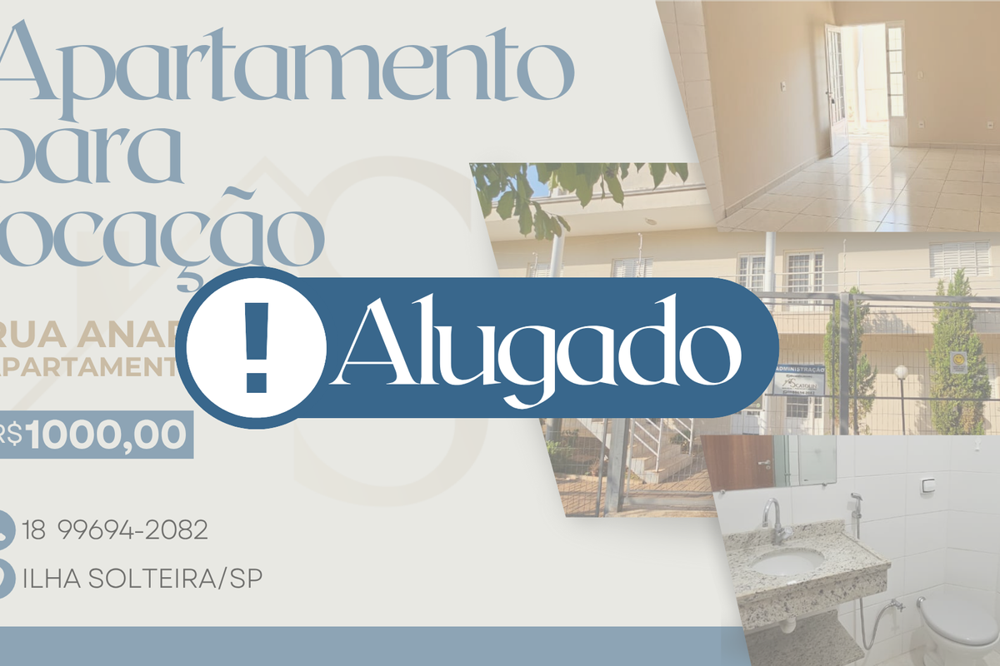

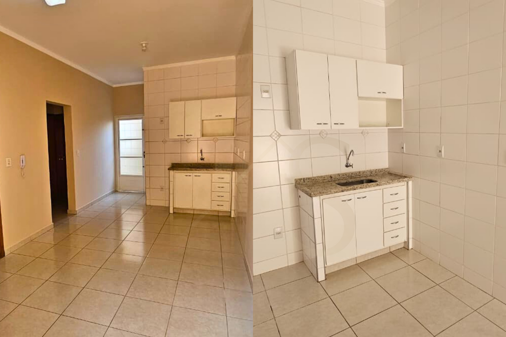

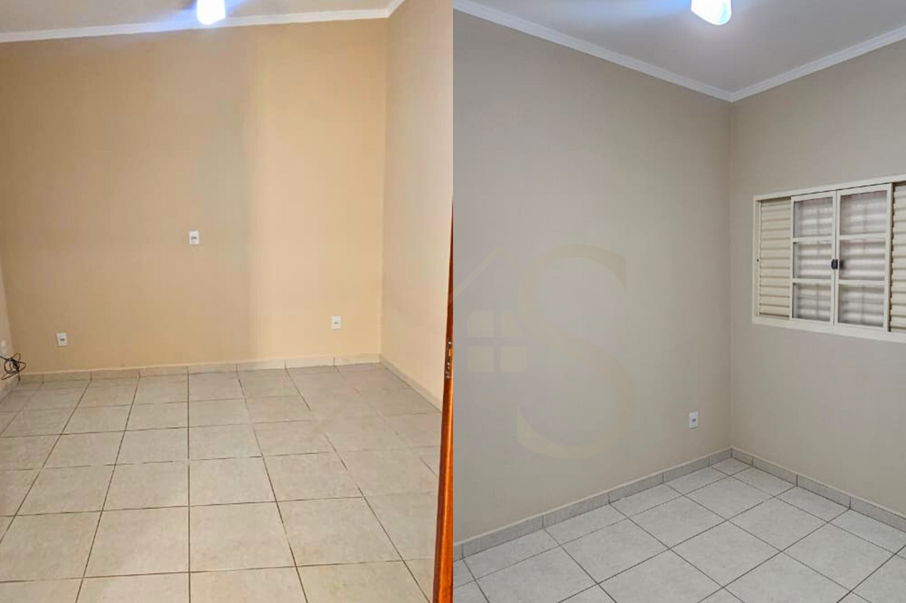

🔗 [Ver no site](https://imovel.sicadiweb.com.br/LOCACAO/DVI-IM-92635A5B07E74354B1C6997613B02D96/IAC-IMOB-35AC99F2)

---

## 20.  Casa para Locação – Zona Sul (Casa de Esquina)

- **Código:** 00069
- **Tipo:** Casa | **Finalidade:** Aluguel
- **Valor:** R$ 1.500
- **Endereço:** Passeio Sorocaba, 401, Zona Sul - Ilha Solteira/SP
- **CEP:** 15388184
- **Composição:** 3 Quartos (sendo 1 Suíte), 1 Banheiro, 2 Vagas, 1m²
- **Características:** Área de serviço, Banheiro da suíte, Corredor, Cozinha, Jardim de inverno, Quintal, Sala

> 
> 
> Está procurando um lar espaçoso, confortável e pronto para morar? Esta excelente casa é perfeita para você e sua família!
> 
> Características do imóvel:
> 
> 3 quartos, sendo 1 suíte
> 
> 2 quartos com guarda-roupas embutidos
> 
> Todos os quartos com ventilador de teto e ar-condicionado
> 
> Sala ampla e bem arejada
> 
> Banheiro social
> 
> Jardim de inverno, ideal para iluminação e ventilação natural
> 
> Cozinha com móveis planejados e fogão Cooktop
> 
> Área de serviço e lavanderia
>

**📷 14 foto(s):**

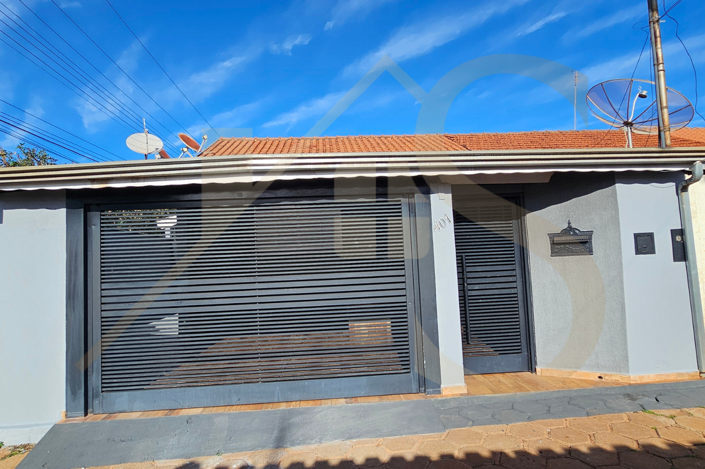

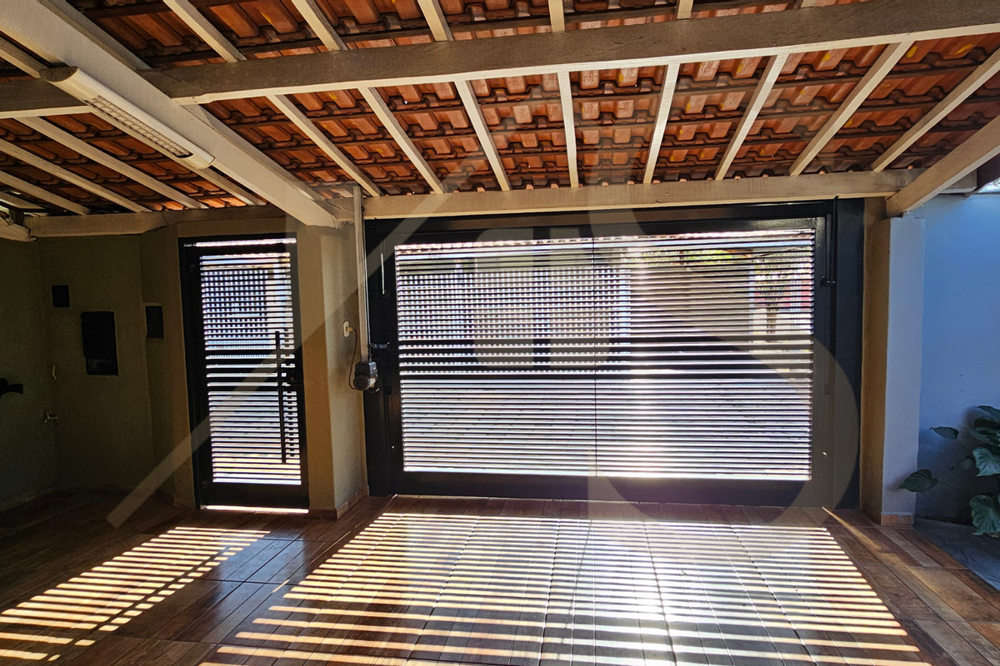

🔗 [Ver no site](https://imovel.sicadiweb.com.br/LOCACAO/DVI-IM-9EFE92A5A587448BA7DC16F9D5F53634/IAC-IMOB-35AC99F2)

---

## 21. Salão Comercial para Locação no Mini Shopping Norte

- **Código:** 00050
- **Tipo:** Salão Comercial | **Finalidade:** Aluguel
- **Valor:** R$ 0
- **Endereço:** Avenida Brasil Norte, 680, Zona Norte - Ilha Solteira/SP
- **CEP:** 15385136
- **Composição:** 1 Banheiro, 1m²

> SALÃO COMERCIAL DISPONÍVEL PARA LOCAÇÃO 
> 
> Se você procura um espaço estratégico, e com excelente fluxo de pessoas, essa é a sua oportunidade!
> 
> Localização privilegiada dentro do Mini Shopping Norte, ideal para receber seu negócio com conforto e praticidade.
> 
> Destaques:
> 
> - Local com alto potencial comercial
> 
> - Ótima iluminação e fachada em vidro
> 
> - Fácil acesso
> 
> Pronto para uso imediato
> 
> Não perca tempo! Agende sua visita e comece a transformar seu negócio ainda ho

**📷 3 foto(s):**

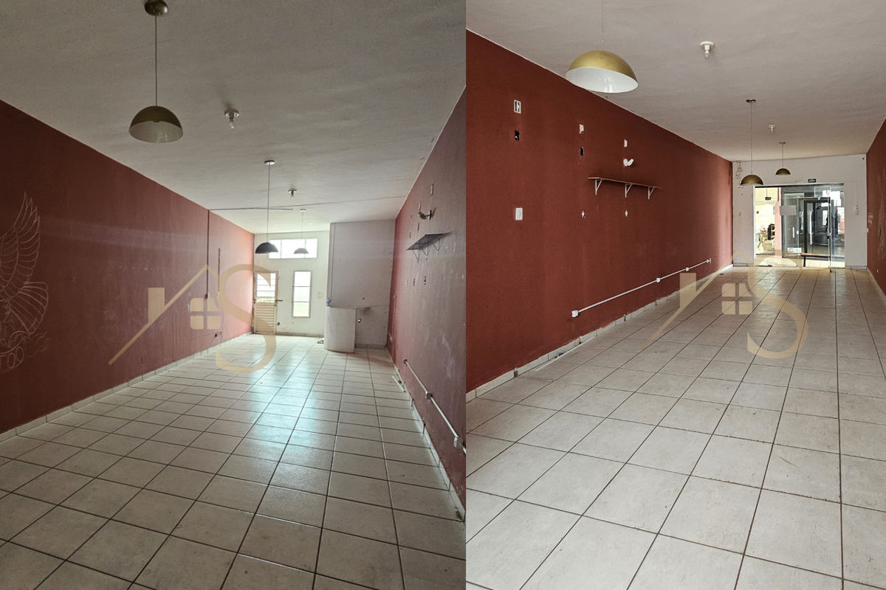

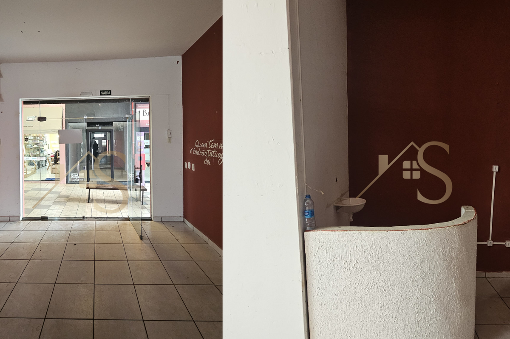

🔗 [Ver no site](https://imovel.sicadiweb.com.br/LOCACAO/DVI-IM-AB87E0A3ACBF45D499EE185EB084BABF/IAC-IMOB-35AC99F2)

---

## 22. Apartamento 2 quartos, Rua Nazaré, 170

- **Código:** 00013
- **Tipo:** Apartamento | **Finalidade:** Aluguel
- **Valor:** R$ 1.200
- **Endereço:** Rua Nazaré, 170, Zona Norte - Ilha Solteira/SP
- **CEP:** 15385162
- **Composição:** 2 Quartos, 1 Banheiro, 1 Vaga, 1m²
- **Condomínio:** [object Object] (Aberto)

> Excelente apartamento para locação, ideal para quem busca praticidade e conforto! Localizado em uma região privilegiada, a poucos minutos do centro da cidade e da UNESP Central, oferecendo fácil acesso a serviços, comércio e transporte público. O imóvel está em ótimo estado de conservação e pronto para morar. Não perca a oportunidade de morar em um local estratégico e de fácil acesso a tudo que você precisa! Agende sua visita e venha conhecer!
> 
> Valor do aluguel: R$ 1.200,00
> Bonificação de 

**📷 5 foto(s):**

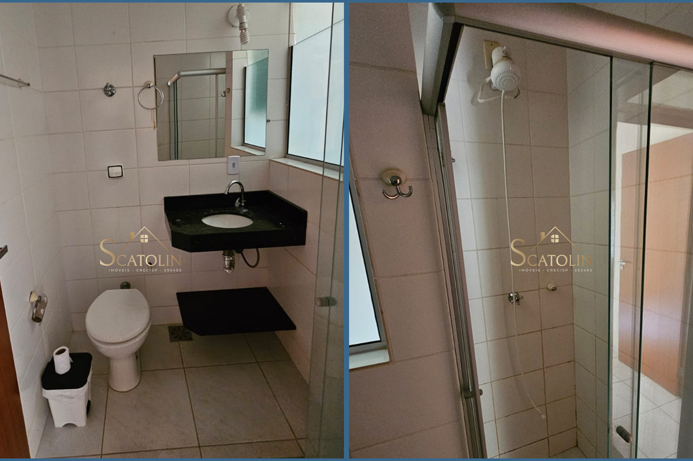

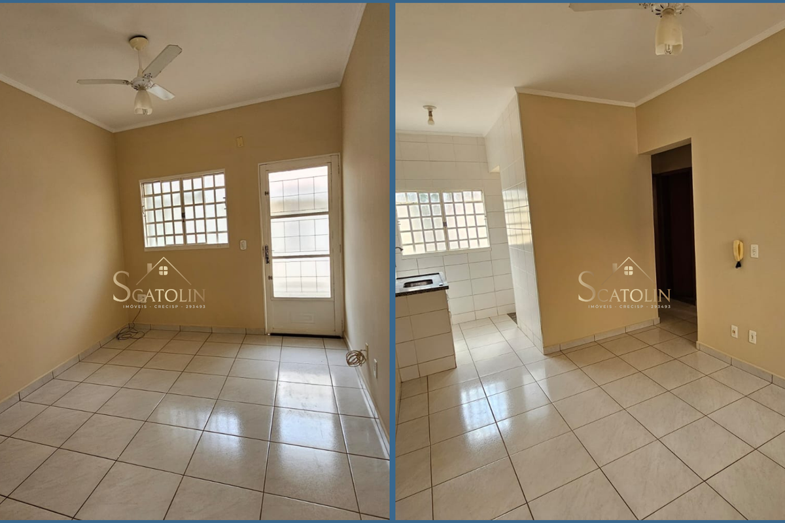

🔗 [Ver no site](https://imovel.sicadiweb.com.br/LOCACAO/DVI-IM-AD4B1D2E2F984537B22D9A1BA6503E0F/IAC-IMOB-35AC99F2)

---

## 23. Lojas para Locação ou Venda Z- Mini Shopping Norte

- **Código:** 00091
- **Tipo:** Loja | **Finalidade:** Aluguel
- **Valor:** R$ 900
- **Endereço:** Avenida Brasil Norte, 680, Zona Norte - Ilha Solteira/SP
- **CEP:** 15385136
- **Composição:** 1m²

> VENDE-SE ou ALUGA-SE — 2 Salas Comerciais no Mini Shopping Norte!
> 
>  Localização estratégica e de grande circulação!
> 
> Você pode adquirir ou alugar apenas uma sala
> 
> Ou levar as duas juntas e ampliar suas possibilidades!
> (A loja 11 tem o 2º pavimento)
> 
> Entre em contato e agende uma visita!
> 
> Não perca a chance de instalar seu negócio em um ponto estratégico e com alto potencial!
> 
> LOCAÇÃO: Loja 9 = R$ 900,00; Loja 11 = R$ 1.400,00 | As duas = R$ 2.000,00
> VENDA: Loja 9 = R$

**📷 10 foto(s):**

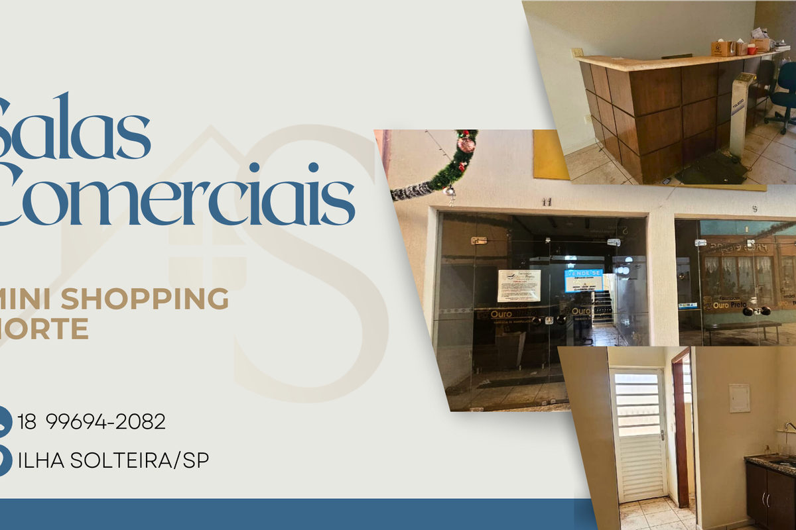

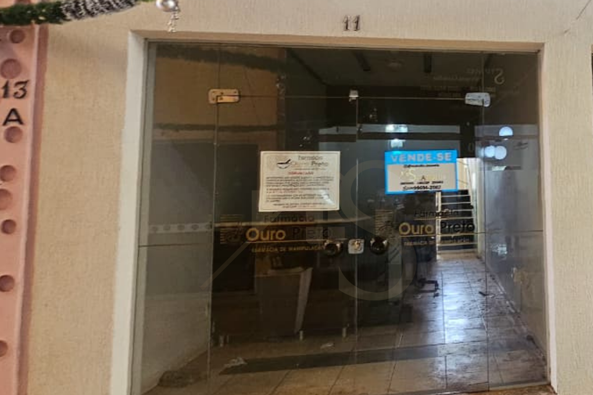

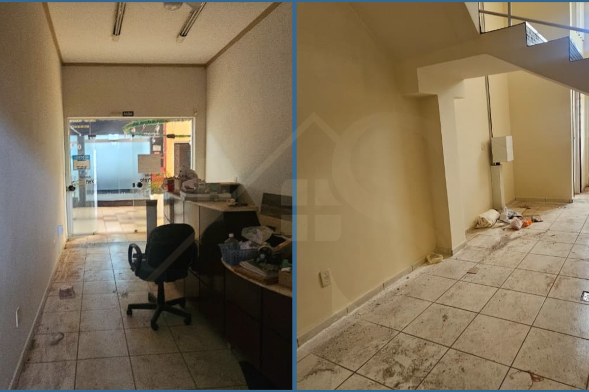

🔗 [Ver no site](https://imovel.sicadiweb.com.br/LOCACAO/DVI-IM-B5762BD2396A4390BA167845295DEF63/IAC-IMOB-35AC99F2)

---

## 24. APARTAMENTO MOBILIADO PARA LOCAÇÃO

- **Código:** 00056
- **Tipo:** Apartamento | **Finalidade:** Aluguel
- **Valor:** R$ 2.500
- **Endereço:** Avenida Atlântica, 1690, Centro - Ilha Solteira/SP
- **CEP:** 15385001
- **Composição:** 2 Quartos, 1 Banheiro, 1 Vaga, 46m²
- **Características:** Cozinha, Quintal, Sala
- **Condomínio:** [object Object] (Aberto)

>  Apartamento recém-mobiliado com varanda privativa disponível para locação!
> 
> Está buscando um lugar moderno, confortável e pronto para morar? Este apê é pra você!
> 
> Destaques do imóvel:
> 
> ➢ Primeira locação mobiliado! Todos os móveis e eletros são novos, sem uso
> -2 quartos com cama box, colchão, armário e ar-condicionado
> -Sala completa com sofá novo, TV e tapete decorativo
> -Cozinha equipada com geladeira, fogão, exaustor, micro-ondas, louças, potes, copos e utensílios
> -Banheiro

**📷 4 foto(s):**

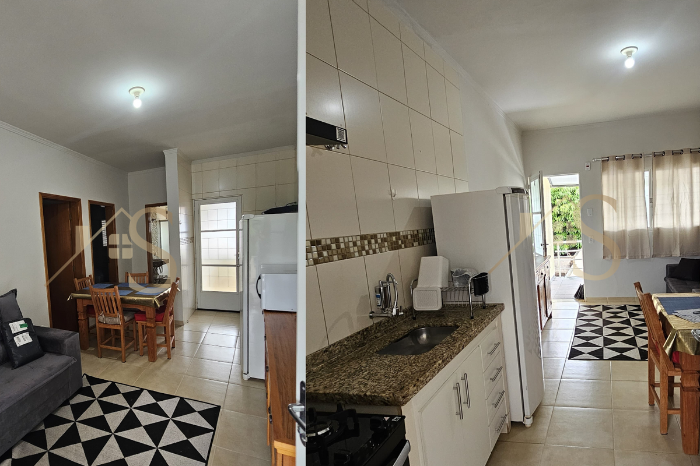

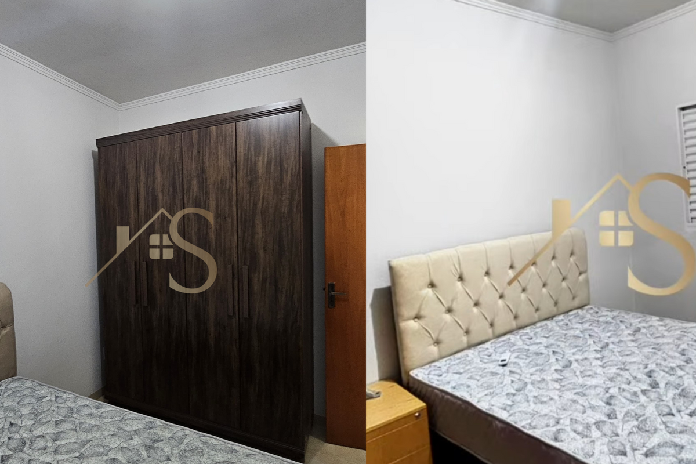

🔗 [Ver no site](https://imovel.sicadiweb.com.br/LOCACAO/DVI-IM-D5A5F39FB91044DBB8E4AF43D36CBABD/IAC-IMOB-35AC99F2)

---

## 25. Casa  para Locação Jardim Novo Horizonte, Ilha Solteira

- **Código:** 00102
- **Tipo:** Casa | **Finalidade:** Aluguel
- **Valor:** R$ 1.300
- **Endereço:** Rua L, 81, Jardim Novo Horizonte - Ilha Solteira/SP
- **CEP:** 15385378
- **Composição:** 3 Quartos, 2 Banheiros, 3 Vagas, 1m²

>  ALUGA-SE CASA – Jardim Novo Horizonte
> 
> Casa para locação em bairro residencial e tranquilo, ideal para quem busca espaço e conforto.
> 
> Características do imóvel:
> 3 quartos
> Sala
> Cozinha
> 1 banheiro social
> Banheiro no fundo
> Garagem com piso
> Lavanderia com 2 tanques
> Quintal
> Corredor nos dois lados da casa
> Bairro: Jardim Novo Horizonte
> 
> até o dia 10 ----> R$1300, 00
> 
> Interessados, chame no direct ou WhatsApp para mais informações e agendar visita.

**📷 13 foto(s):**

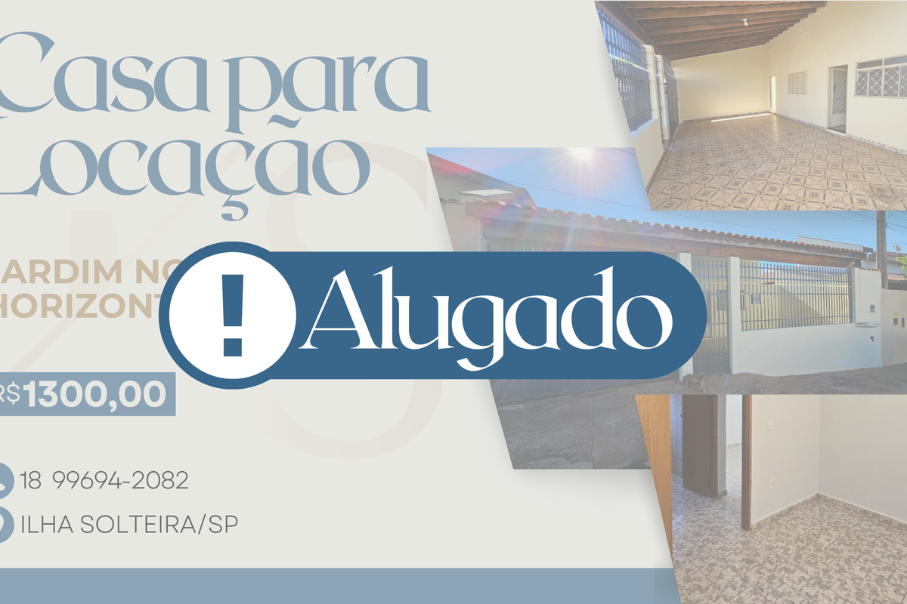

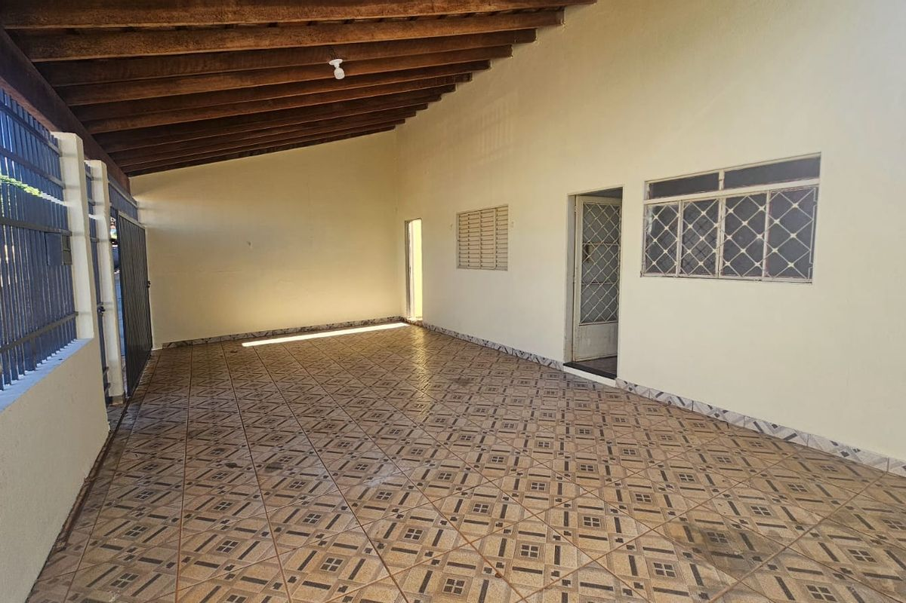

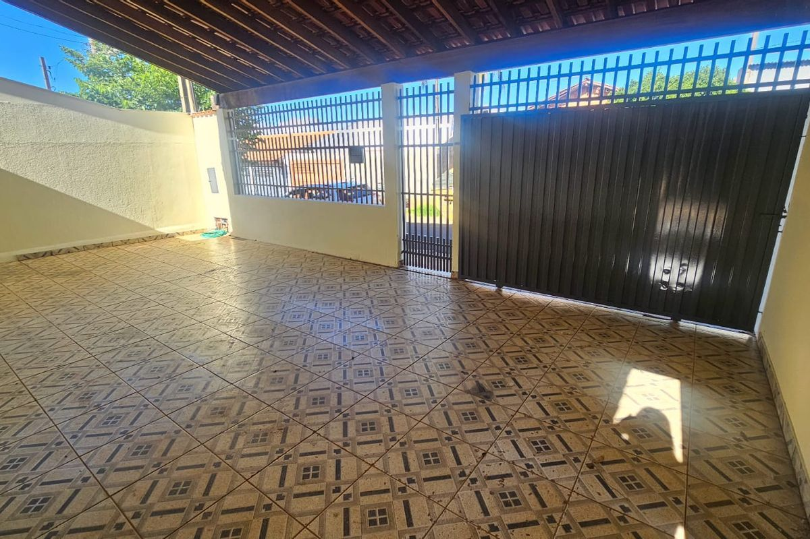

🔗 [Ver no site](https://imovel.sicadiweb.com.br/LOCACAO/DVI-IM-E101231C758640AD91FF090ACEBE8531/IAC-IMOB-35AC99F2)

---

## 26. GALPÃO À VENDA - Excelente Oportunidade de Imóvel Comercial e Industrial!

- **Código:** 00026
- **Tipo:** Galpão | **Finalidade:** Aluguel
- **Valor:** R$ 1.700
- **Endereço:** Avenida Marginal Oeste, 370, Jardim Aeroporto - Ilha Solteira/SP
- **CEP:** 15387000
- **Composição:** 2m²

> Este imóvel é uma excelente oportunidade para empresas ou investidores que buscam um espaço estratégico e funcional. A área construída de 980 m², composta por um galpão com estrutura robusta, é ideal para atividades comerciais, industriais ou logísticas, oferecendo flexibilidade para diversos tipos de negócios.
> O escritório de 30 m² é um ambiente perfeito para a gestão administrativa da empresa, com acesso direto ao galpão, proporcionando praticidade e eficiência para o dia a dia operacional.

**📷 11 foto(s):**

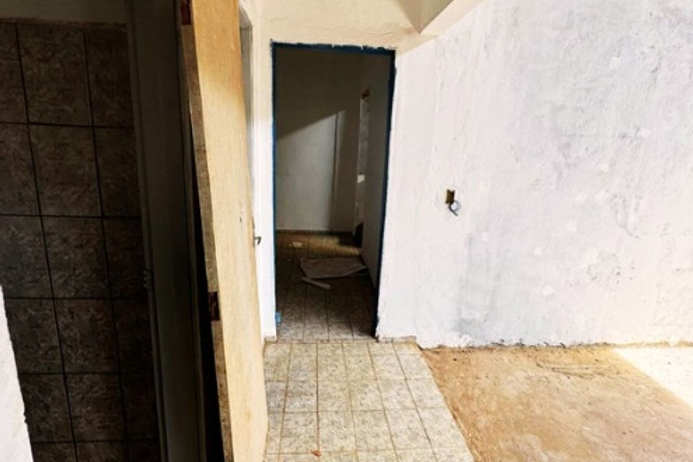

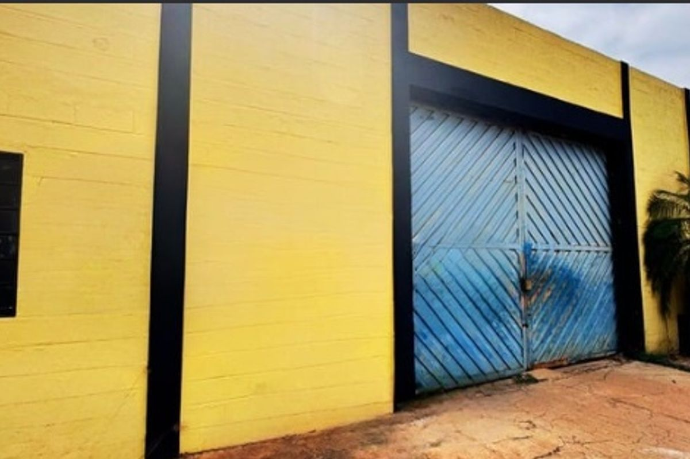

🔗 [Ver no site](https://imovel.sicadiweb.com.br/LOCACAO/DVI-IM-E3DEA5403AC048D990D780C58B5F73AF/IAC-IMOB-35AC99F2)

---

## 27. Casa 5 quartos para Locação Zona Sul, Ilha Solteira

- **Código:** 00075
- **Tipo:** Casa | **Finalidade:** Aluguel
- **Valor:** R$ 3.200
- **Endereço:** Passeio Brilhante, 203, Zona Sul - Ilha Solteira/SP
- **CEP:** 15388018
- **Composição:** 5 Quartos (sendo 2 Suítes), 3 Banheiros, 2 Vagas, 1m²
- **Características:** Área de lazer, Churrasqueira, Corredor, Cozinha, Edícula, Lavabo, Quintal, Sala, Sala de jantar

> Espaço, conforto e praticidade para sua família!
> 
> Essa excelente casa está disponível para locação e oferece tudo o que você procura: ambientes amplos, estrutura completa e área de lazer para aproveitar cada momento!
> 
> Características do imóvel:
> 
> -Sala ampla e bem iluminada
> -5 dormitórios, 2 suítes
> -1 banheiro social
> -1 lavabo
> -Cozinha com armários planejados
> -Todos os quartos com armários planejados
> -Área gourmet com churrasqueira
> -Quintal espaçoso
> 
> Imóvel pronto pa

**📷 18 foto(s):**

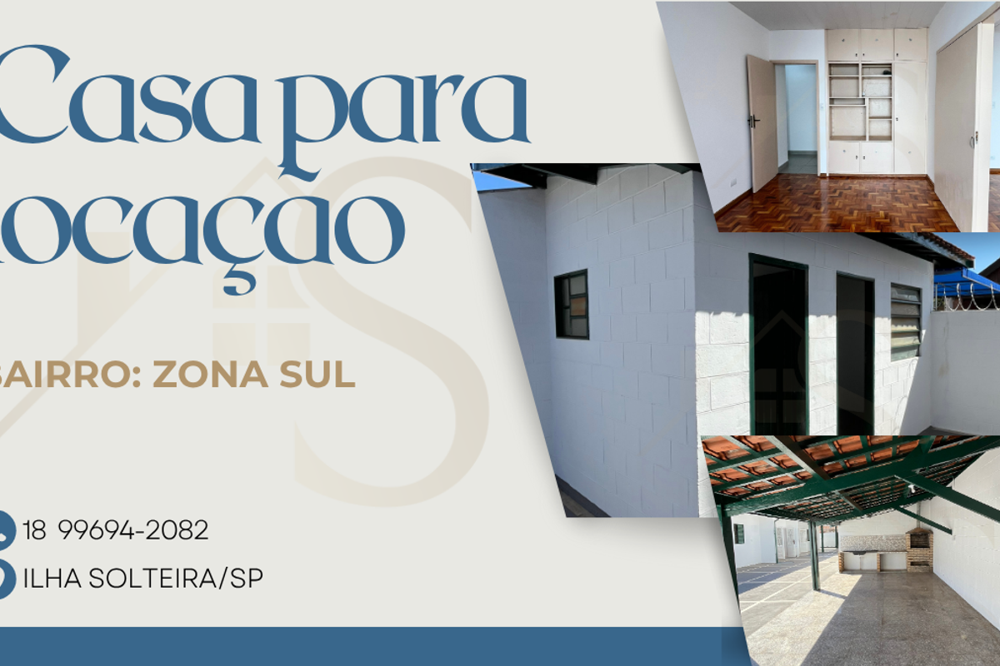

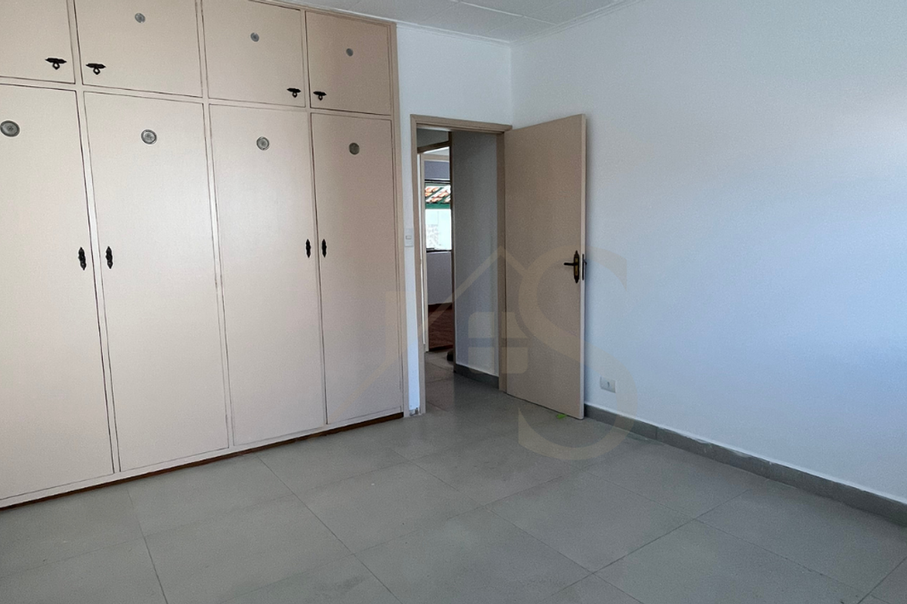

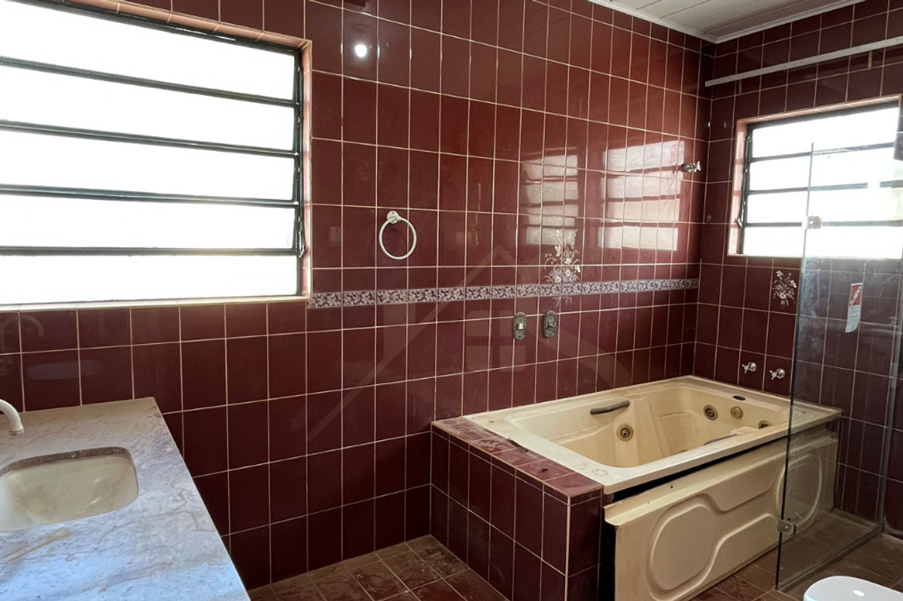

🔗 [Ver no site](https://imovel.sicadiweb.com.br/LOCACAO/DVI-IM-E5D5F574A03E41D899536AEB7377DD64/IAC-IMOB-35AC99F2)

---

## 28. Casa 2 quartos para Locação Zona Norte, Ilha Solteira

- **Código:** 0083
- **Tipo:** Casa | **Finalidade:** Aluguel
- **Valor:** R$ 1.000
- **Endereço:** Passeio Fortaleza, 406, Zona Norte - Ilha Solteira/SP
- **CEP:** 15385220
- **Composição:** 2 Quartos, 1 Banheiro, 2 Vagas, 1m²

>  Casa para locação no Passeio Fortaleza, 406
> 
> Excelente localização, próxima a comércios, mercado e posto de gasolina.
> 
> 2 quartos
> Sala de estar
> Sala de jantar
> Cozinha espaçosa
> Banheiro
> Área no fundo
> Garagem para até 2 carros
> 
> Ideal para quem busca praticidade e conforto no dia a dia.
> 
> R$1000, 00
> 
> Entre em contato e agende sua visita!

**📷 13 foto(s):**

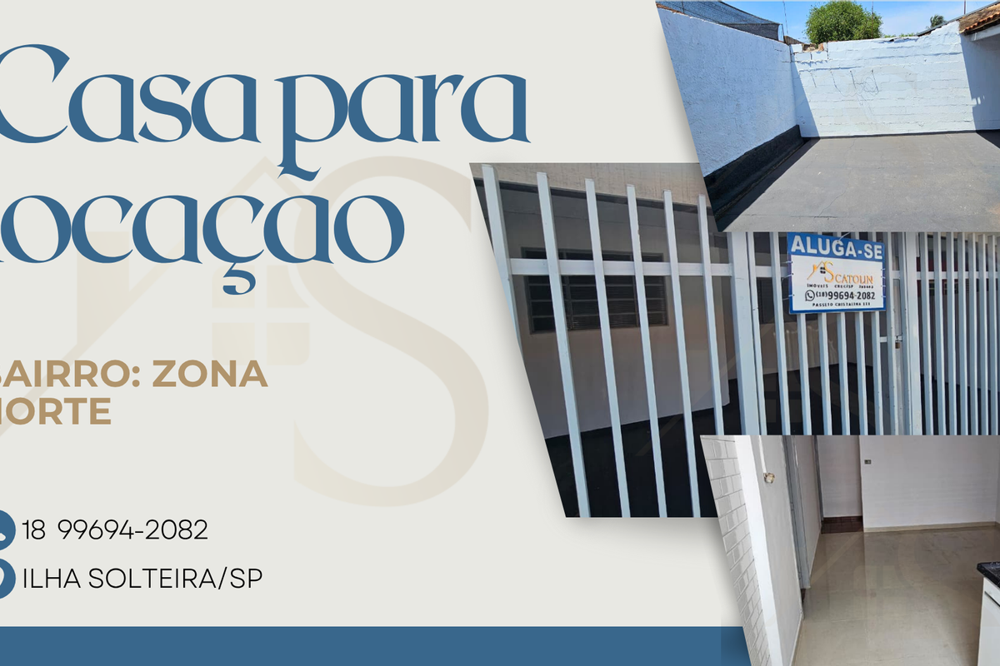

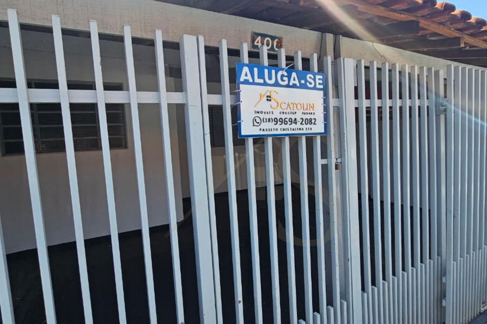

🔗 [Ver no site](https://imovel.sicadiweb.com.br/LOCACAO/DVI-IM-EE83B136C39D4016A3915BD9A2FC31E7/IAC-IMOB-35AC99F2)

---

## 29. Casa com Piscina à venda

- **Código:** 00097
- **Tipo:** Casa | **Finalidade:** Venda
- **Valor:** R$ 450.000
- **Endereço:** Rua João Ubaldo Ribeiro, S/N, Jardim Ilha do Sol - Ilha Solteira/SP
- **CEP:** 15387208
- **Composição:** 1 Quarto (sendo 1 Suíte), 1 Banheiro, 2 Vagas, 1m²

> Oportunidade Imperdível em Ilha Solteira!
> Casa à Venda – R$ 450.000,00
> 
> Se você procura conforto, lazer e localização privilegiada, essa é a casa perfeita para sua família!
> 
> Residencial Jardim Ilha do Sol – Rua João Ubaldo Ribeiro
> 
> Descrição do imóvel:
> -Garagem para veículo
> -Sala de estar
> -03 dormitórios, sendo 01 suíte
> -Banheiro social
> -Cozinha gourmet
> -Área de serviço
> -Piscina
> -Quintal
> 
> -Facilidades na negociação:
> -Aceita veículo e imóvel como parte do pagam

**📷 6 foto(s):**

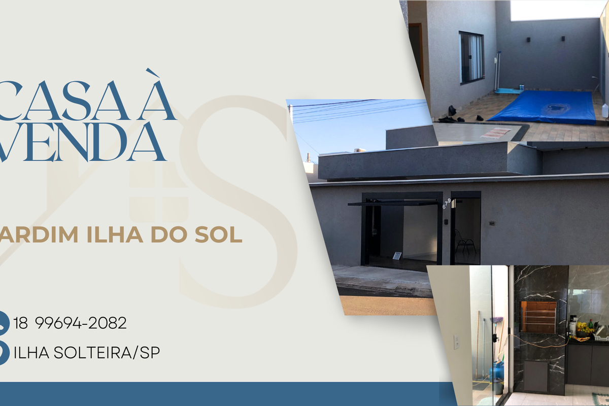

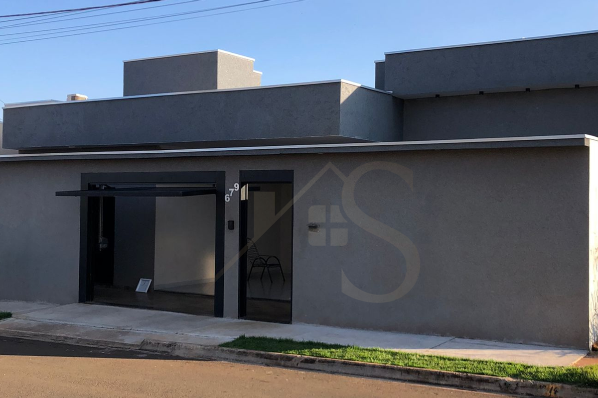

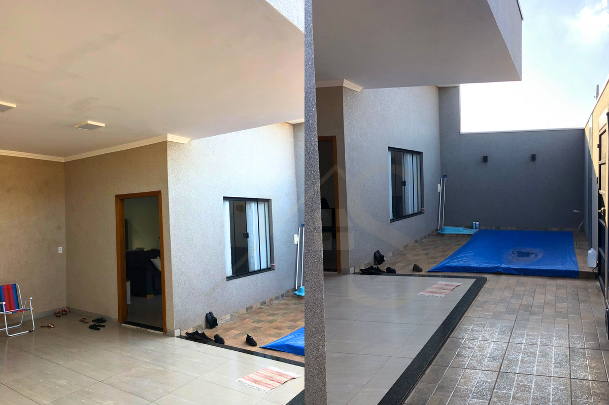

🔗 [Ver no site](https://imovel.sicadiweb.com.br/VENDA/DVI-IM-002C7DCE6C47417BAE50D40D4426DFF6/IAC-IMOB-35AC99F2)

---

## 30. Ponto Comercial - Vende-se ou Aluga-se

- **Código:** 00100
- **Tipo:** Ponto Comercial | **Finalidade:** Venda
- **Valor:** R$ 420.000
- **Endereço:** Rua 7 de Setembro, s/n, Jardim Aeroporto - Ilha Solteira/SP
- **CEP:** 15387036
- **Composição:** 1m²

> Aluga-se ou Vende-se – Prédio Comercial
> 
> Rua 7 de Setembro – Jardim Aeroporto, Ilha Solteira/SP
> 
> Ponto estratégico e já consolidado na região
> Estrutura completa com móveis, balcões e equipamentos
> Pronto para funcionamento imediato
> 
> Excelente oportunidade de investimento seguro e rentável!
> 
> Informações: (18) 99694-2082 – Scatolin Imóveis
> 
> Aluguel: 2.000,00 (Só a Farmácia)
> Venda: 420.000,00 (Farmácia + apartamento em cima)

**📷 6 foto(s):**

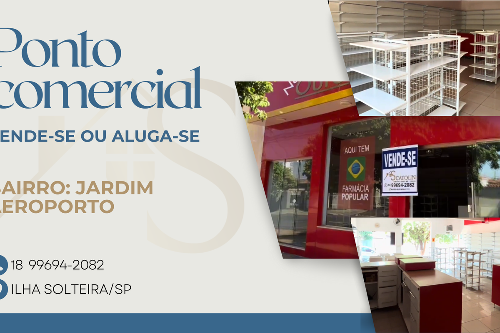

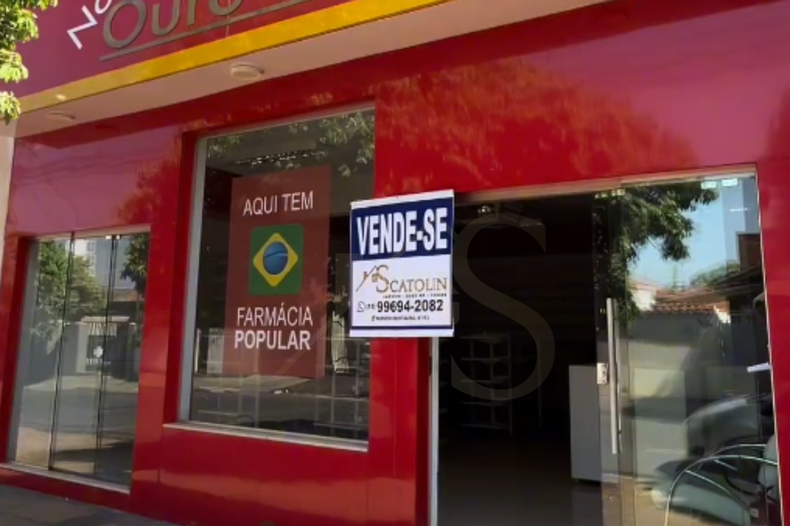

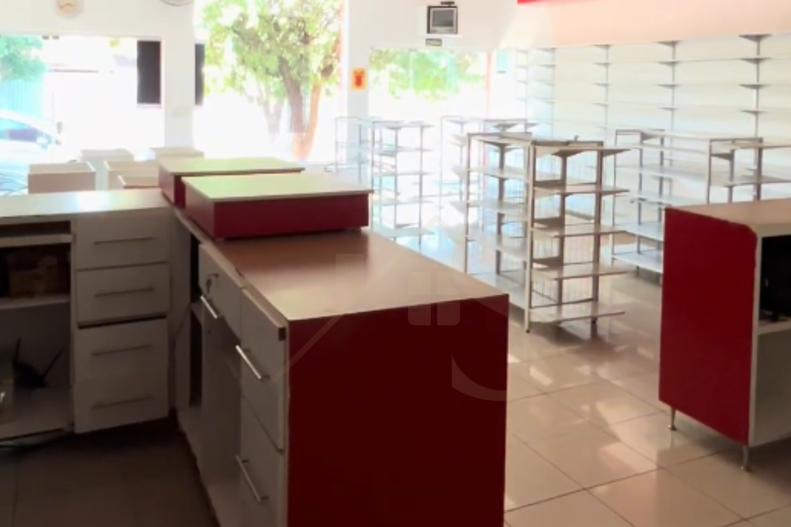

🔗 [Ver no site](https://imovel.sicadiweb.com.br/VENDA/DVI-IM-0AEF4388385144D59953A91B26F0A41E/IAC-IMOB-35AC99F2)

---

## 31. Casa 3 quartos para venda Zona Norte, Ilha Solteira

- **Código:** 00077
- **Tipo:** Casa | **Finalidade:** Venda
- **Valor:** R$ 700.000
- **Endereço:** Rua Canavieiras, 546, Zona Norte - Ilha Solteira/SP
- **CEP:** 15385176
- **Composição:** 3 Quartos (sendo 1 Suíte), 3 Banheiros, 4 Vagas, 1m²
- **Características:** Banheiro área de lazer, Banheiro da suíte, Calçada, Churrasqueira, Corredor, Cozinha, Jardim, Quintal, Sala, Sala de jantar, Sala de TV

> Se você procura um lar acolhedor, funcional e com excelente aproveitamento de espaço, esta é a sua oportunidade!
> 
> Imóvel com:
> 
> -3 dormitórios, sendo 1 suíte
> -Sala de TV
> -Sala de estar
> -Sala de jantar
> -Banheiro social
> -Cozinha
> -Área gourmet com churrasqueira
> -Quarto nos fundos
> -Banheiro nos fundos
> -Interfone com câmera
> -Portão basculante eletrônico
> 
> 
> 
> Um imóvel que une conforto, segurança e praticidade em cada detalhe!
> Entre em contato e agende uma visita par

**📷 13 foto(s):**

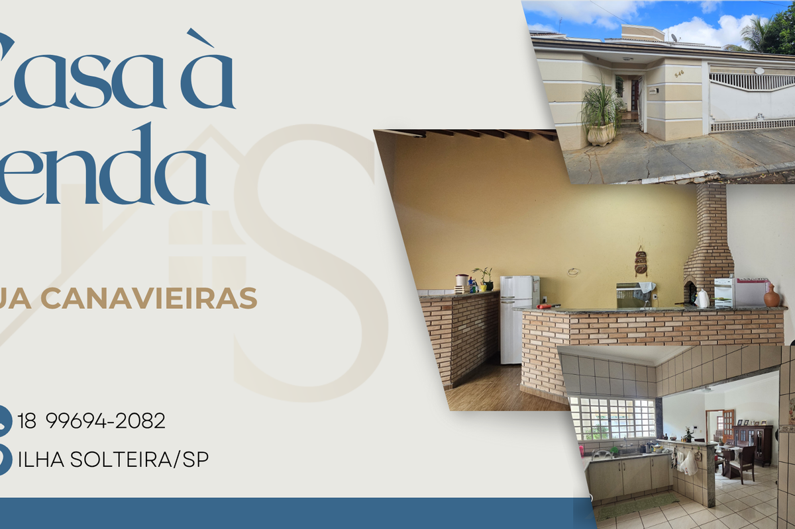

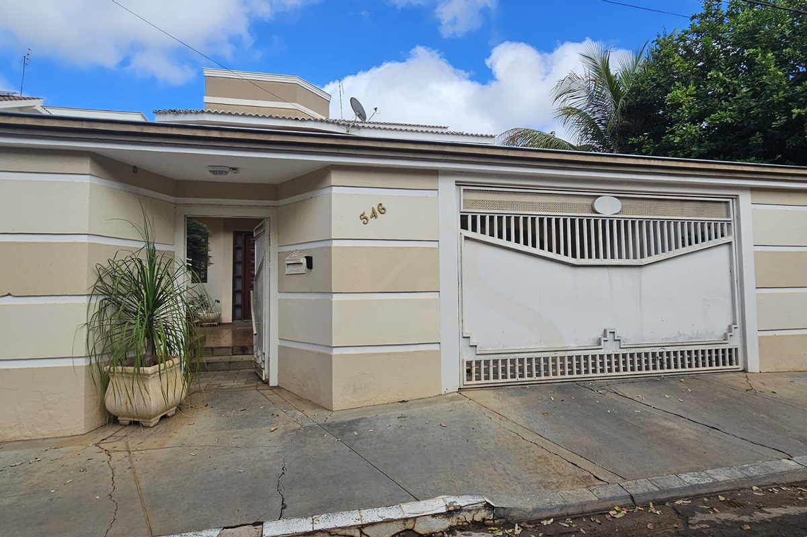

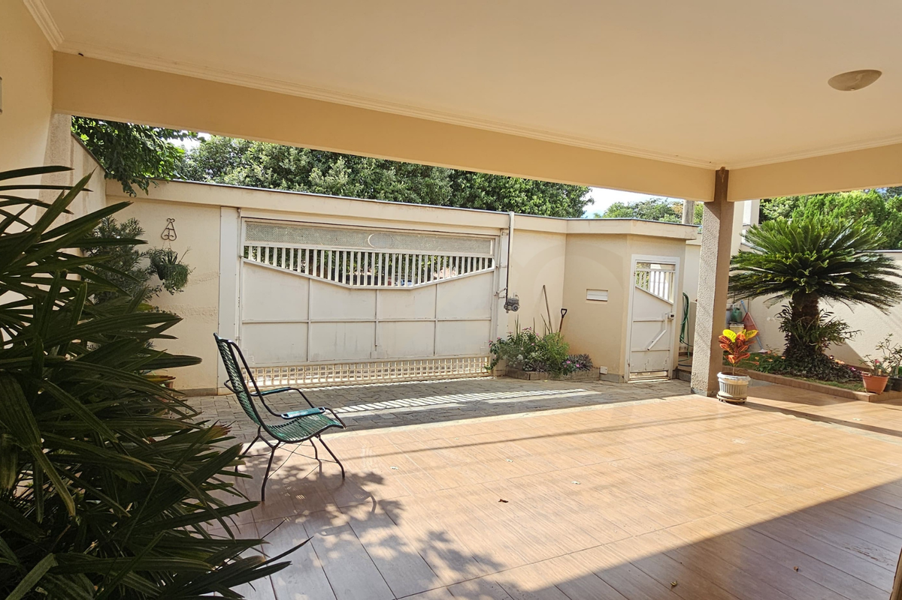

🔗 [Ver no site](https://imovel.sicadiweb.com.br/VENDA/DVI-IM-1C386CC69FBA43D7948801C8671CBA65/IAC-IMOB-35AC99F2)

---

## 32. Casa NOVA à Venda - Jardim Ilha do Sol

- **Código:** 00096
- **Tipo:** Casa | **Finalidade:** Venda
- **Valor:** R$ 430.000
- **Endereço:** Rua Rachel de Queiroz, S/N, Jardim Ilha do Sol - Ilha Solteira/SP
- **CEP:** 15387224
- **Composição:** 2 Quartos (sendo 1 Suíte), 1 Banheiro, 2 Vagas, 1m²

> Casa nova à venda – Jardim Ilha do Sol
> Rua Rachel de Queiroz
> 
> Casa nova, pronta pra morar!
> 
> Sala ampla
> 02 dormitórios (sendo 01 suíte)
> Banheiro social
> Cozinha gourmet
> Área de serviço
> 
> Aceita financiamento bancário
> Valor: R$ 430.000,00
> Aceita proposta

**📷 10 foto(s):**

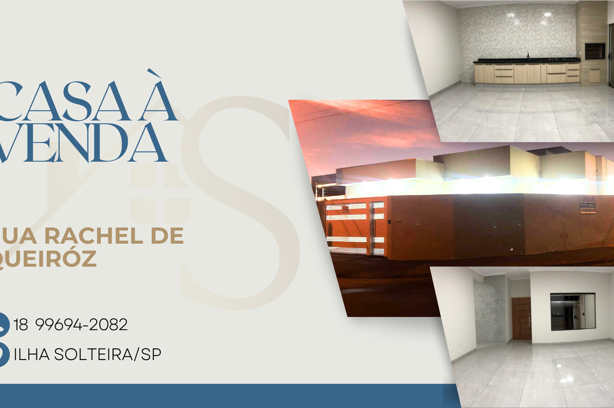

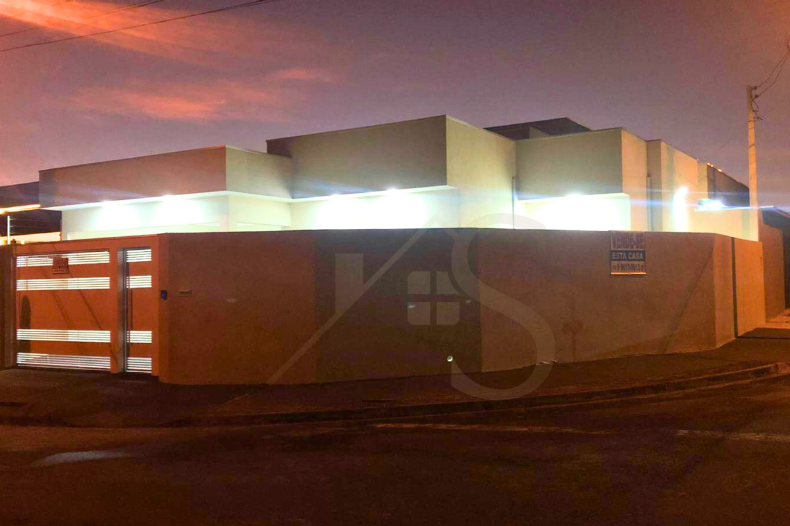

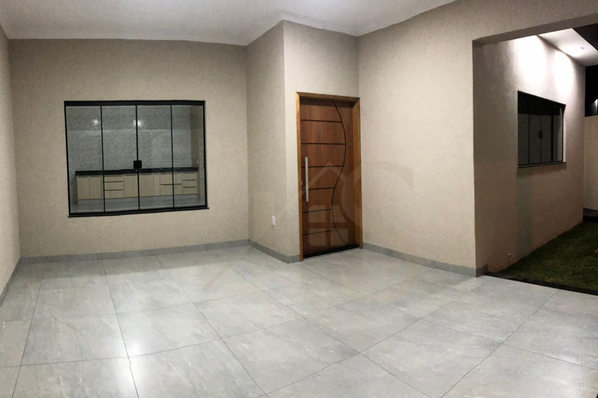

🔗 [Ver no site](https://imovel.sicadiweb.com.br/VENDA/DVI-IM-280762E7C7FB411B8F70F3B13D1FF50B/IAC-IMOB-35AC99F2)

---

## 33. Terreno Exclusivo à Venda no Portal da Praia! 

- **Código:** 00036
- **Tipo:** Terreno Residencial | **Finalidade:** Venda
- **Valor:** R$ 150.000
- **Endereço:** Rua Praia de Maresias, , Portal da Praia - Ilha Solteira/SP
- **CEP:** 15386016
- **Composição:** 1m²

> Este terreno é perfeito para quem deseja construir ou investir em uma área valorizada e com localização privilegiada.

**📷 1 foto(s):**

🔗 [Ver no site](https://imovel.sicadiweb.com.br/VENDA/DVI-IM-29D96EAF28DA49739574F715B7D9FCF7/IAC-IMOB-35AC99F2)

---

## 34. LOTES APARTIR DE R$ 530,00

- **Código:** 00090
- **Tipo:** Lote em Condomínio | **Finalidade:** Venda
- **Valor:** R$ 100.000
- **Endereço:** Avenida Atlântica, S/N, Zona Sul - Ilha Solteira/SP
- **CEP:** 15388146
- **Composição:** 1m²

> O Loteamento Village Parra é o novo endereço dos seus sonhos, em uma localização privilegiada, ao lado do Residencial Portal do Sol e bem em frente ao Beach Tennis. Os lotes estão incríveis, com condições imperdíveis.
> 
> São terrenos amplos, a partir de 253 m², equivalentes a um lote de aproximadamente 20 x 13 metros, perfeitos para quem busca espaço e conforto.
> As condições de pagamento são facilitadas, com parcelas em até 180x e valores a partir de R$530,00.
> 
> O financiamento é direto c

**📷 5 foto(s):**

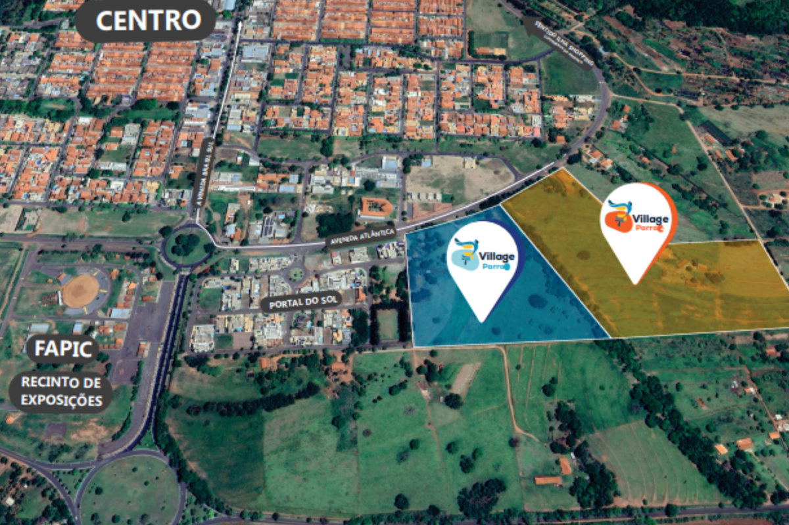

🔗 [Ver no site](https://imovel.sicadiweb.com.br/VENDA/DVI-IM-357284B261C64944B3A46BD09AA7E151/IAC-IMOB-35AC99F2)

---

## 35. Casa 3 quartos para Venda Zona Norte, Ilha Solteira

- **Código:** 00073
- **Tipo:** Casa | **Finalidade:** Venda
- **Valor:** R$ 310.000
- **Endereço:** Passeio Monção, 215, Zona Norte - Ilha Solteira/SP
- **CEP:** 15385088
- **Composição:** 3 Quartos, 2 Banheiros, 3 Vagas, 1m²
- **Características:** Churrasqueira, Cozinha, Corredor, Quintal, Sala

> Oportunidade Imperdível! Sua nova casa está aqui!
> 
> Passeio Monção, 215 – Zona Norte
> 
> Características do imóvel:
> 
> - 3 quartos
> - 2 banheiros
> - Sala espaçosa
> - Cozinha
> - Quintal com excelente espaço
> - Garagem coberta para 3 carros
> - Lavanderia
> - Churrasqueira
> - 3 aparelhos de ar-condicionado
> 
> Casa nível 04, de esquina – mais privacidade e ventilação!
> 
> Tudo isso por apenas: R$ 310.000,00
> 
> Agende sua visita agora mesmo e venha se encantar!

**📷 5 foto(s):**

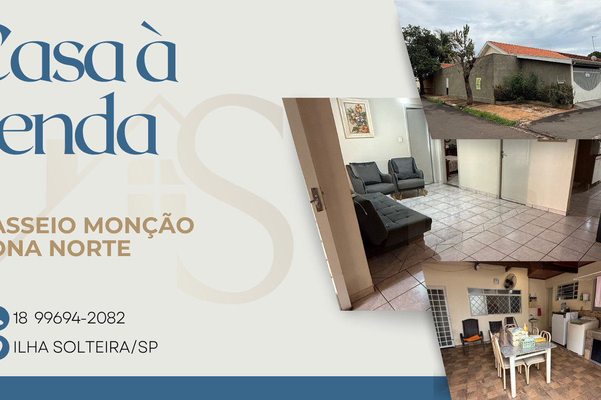

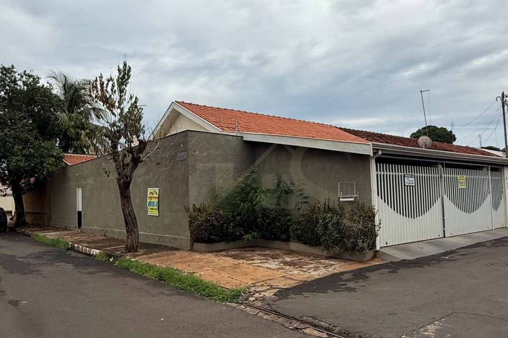

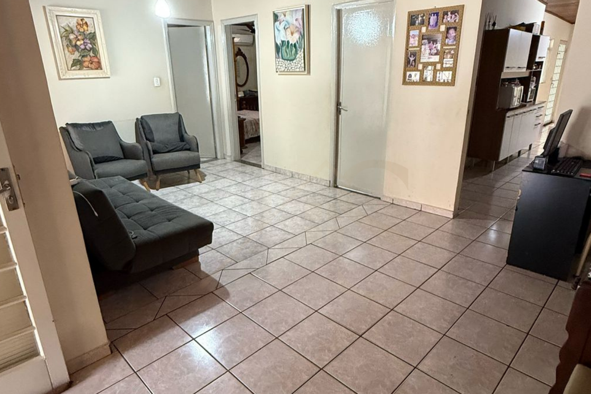

🔗 [Ver no site](https://imovel.sicadiweb.com.br/VENDA/DVI-IM-4EE57E2E7ADE4AC581B4FDF06F3CA22B/IAC-IMOB-35AC99F2)

---

## 36. Apartamento à venda -  Zona Sul

- **Código:** 00098
- **Tipo:** Apartamento | **Finalidade:** Venda
- **Valor:** R$ 320.000
- **Endereço:** Rua Barbacena, S/Nérreo, Zona Sul - Ilha Solteira/SP
- **CEP:** 15388046
- **Composição:** 2 Quartos, 2 Banheiros, 1 Vaga, 64m²
- **Características:** Cozinha, Sala

> Apartamento à venda — seu novo apê te espera!
> 
> 2 quartos com ar-condicionado, sala e cozinha integradas com planejados, banheiro social, lavanderia + banheiro extra e garagem coberta — tudo em 64,45 m².
> 
>  Rua Barbacena – Cond. Residencial Pedras Preciosas (Torre Rubi)
> Pronto para morar: conforto + praticidade + localização top.
> Valor: R$ 320.000,00

**📷 6 foto(s):**

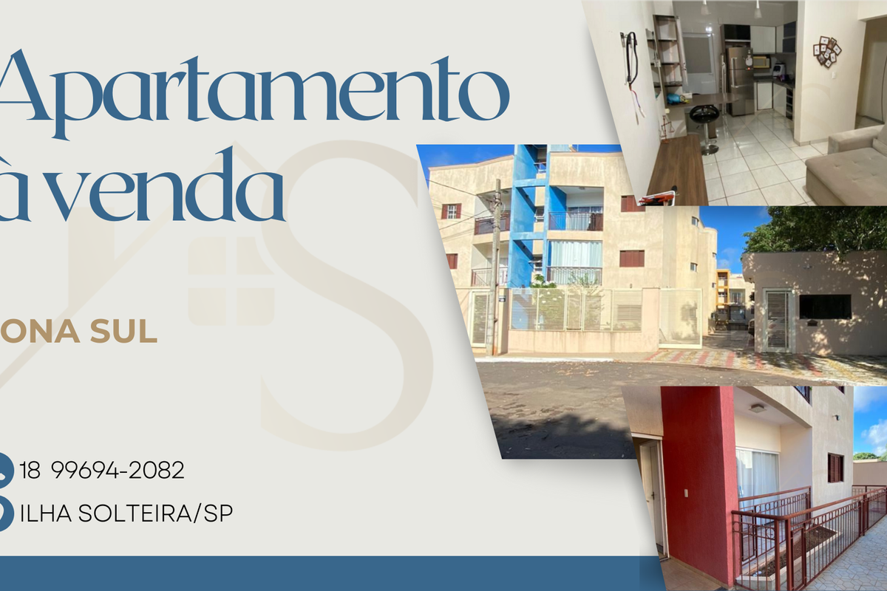

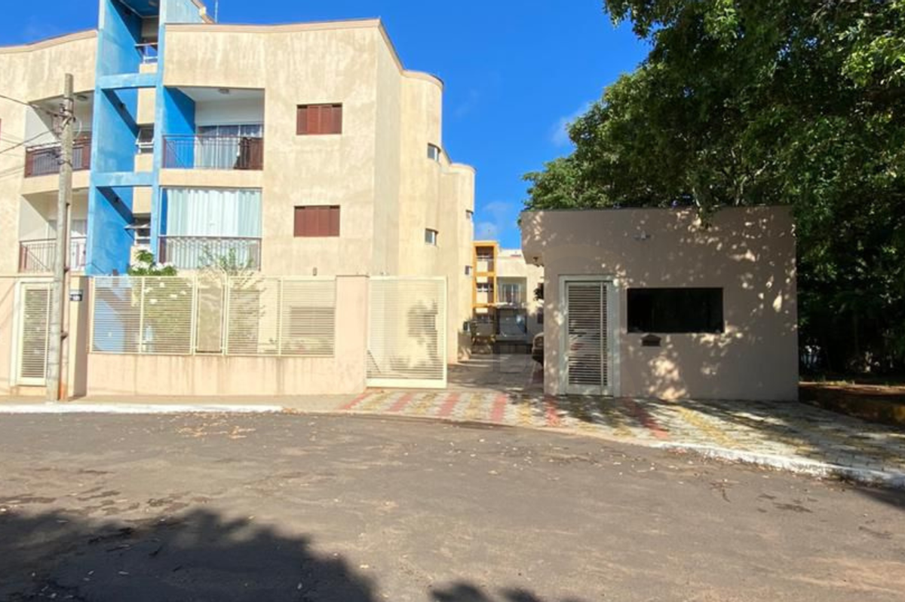

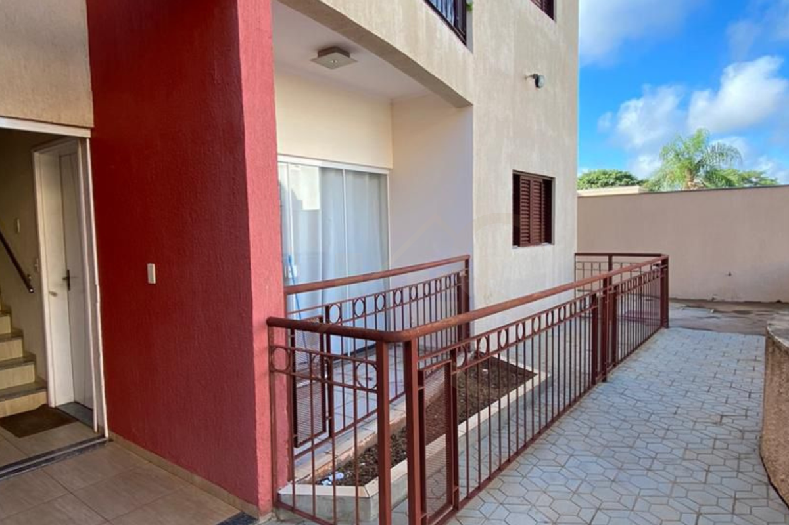

🔗 [Ver no site](https://imovel.sicadiweb.com.br/VENDA/DVI-IM-4F7CC493E6E541E49D05D646BFCC5184/IAC-IMOB-35AC99F2)

---

## 37. Casa 1 quarto para Venda Jardim Ilha do Sol, Ilha Solteira

- **Código:** 00062
- **Tipo:** Casa | **Finalidade:** Venda
- **Valor:** R$ 400.000
- **Endereço:** Rua Jorge Amado, 571, Jardim Ilha do Sol - Ilha Solteira/SP
- **CEP:** 15387218
- **Composição:** 1 Quarto (sendo 1 Suíte), 3 Banheiros, 1m²
- **Características:** Área de lazer, Banheiro área de lazer, Banheiro da suíte, Churrasqueira, Cozinha Gourmet, Piscina, Sala de jantar, Sala de TV

> -Suíte Master: Conforto total com 2 camas de casal, 1 solteiro, ventilador de teto, ar-condicionado e TV.
> -Sala: Espaço amplo que pode ser usado como quarto extra, com TV Sky, ventilador de teto e ar-condicionado.
> -Área Gourmet Completa: Equipada para seus melhores churrascos e reuniões, com 2 ventiladores de parede, ar-condicionado e TV.
> -1 Banheiro Social
> -Piscina Aquecida: Com placas solares e iluminação para usar a qualquer hora!
> -Lavanderia e Despensa
> 
> Localização Privilegiada

**📷 4 foto(s):**

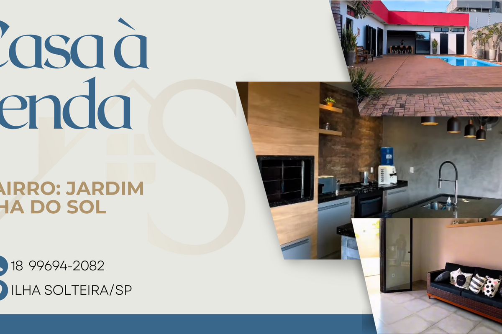

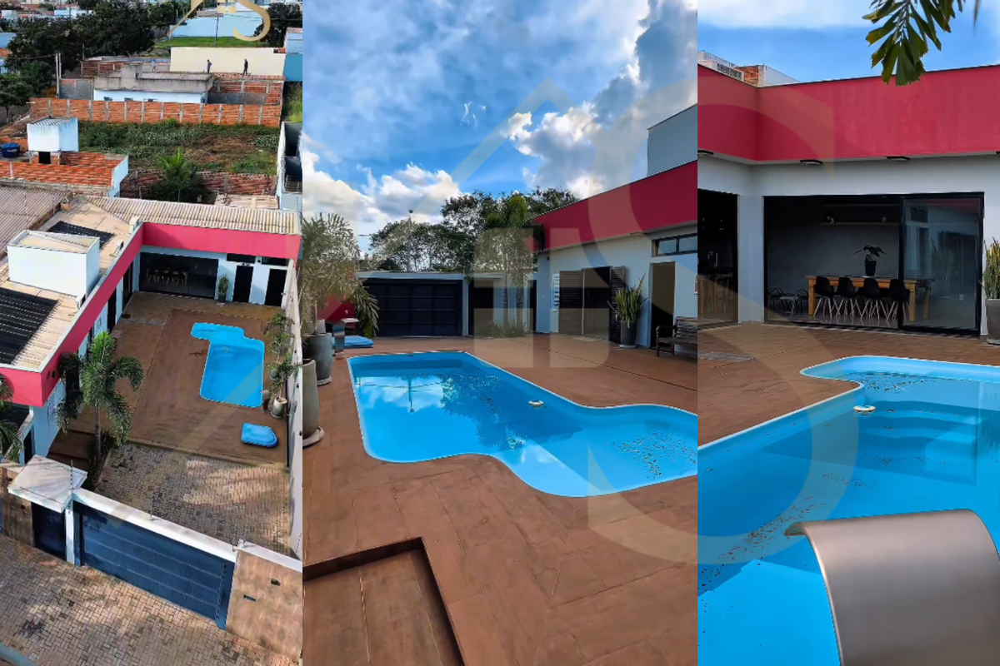

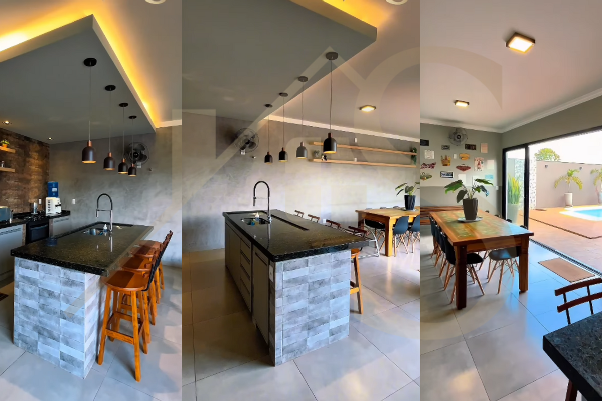

🔗 [Ver no site](https://imovel.sicadiweb.com.br/VENDA/DVI-IM-6554701EB9A04E8EBAB4FA29C49D55D0/IAC-IMOB-35AC99F2)

---

## 38. Terreno Residencial para Locação Zona Norte, Ilha Solteira

- **Código:** 00085
- **Tipo:** Terreno Residencial | **Finalidade:** Venda
- **Valor:** R$ 330.000
- **Endereço:** Rua Rio São Francisco, s/n, Zona Norte - Ilha Solteira/SP
- **CEP:** 15385138
- **Composição:** 270m²

> Terreno com excelente localização, perto do Proença do Norte.
> Próximo de comércio, farmácia, escolas e todos os serviços essenciais.
> 
> Ótima oportunidade para construir a sua casa / projeto de investimento.

**📷 1 foto(s):**

🔗 [Ver no site](https://imovel.sicadiweb.com.br/VENDA/DVI-IM-70A8488B0FE449F6B2A46D17AD316F5B/IAC-IMOB-35AC99F2)

---

## 39. Casa 3 quartos para Venda Jardim Ilha do Sol, Ilha Solteira

- **Código:** 00079
- **Tipo:** Casa | **Finalidade:** Venda
- **Valor:** R$ 355.000
- **Endereço:** Rua Euclides da Cunha, , Jardim Ilha do Sol - Ilha Solteira/SP
- **CEP:** 15387202
- **Composição:** 3 Quartos (sendo 1 Suíte), 1 Banheiro, 2 Vagas, 1m²
- **Características:** Área de serviço, Banheiro da suíte, Calçada, Churrasqueira, Corredor, Cozinha, Quintal, Sala, Sala de jantar

> O lar perfeito para a sua família chegou!
> 
> Localizada no Jardim Ilha do Sol – Ilha Solteira/SP, esta casa novinha foi projetada para oferecer conforto, praticidade e modernidade em cada ambiente.
> 
> 03 dormitórios, sendo 1 suíte
> 
> Sala de estar e jantar integradas com pé-direito elevado (amplitude e sofisticação)
> 
> Cozinha moderna equipada com fogão e forno
> 
> Banheiro social
> 
> Área de serviço
> 
> Garagem para 2 carros
> 
> Completa em iluminação LED
> 
> Documentação em dia, i

**📷 5 foto(s):**

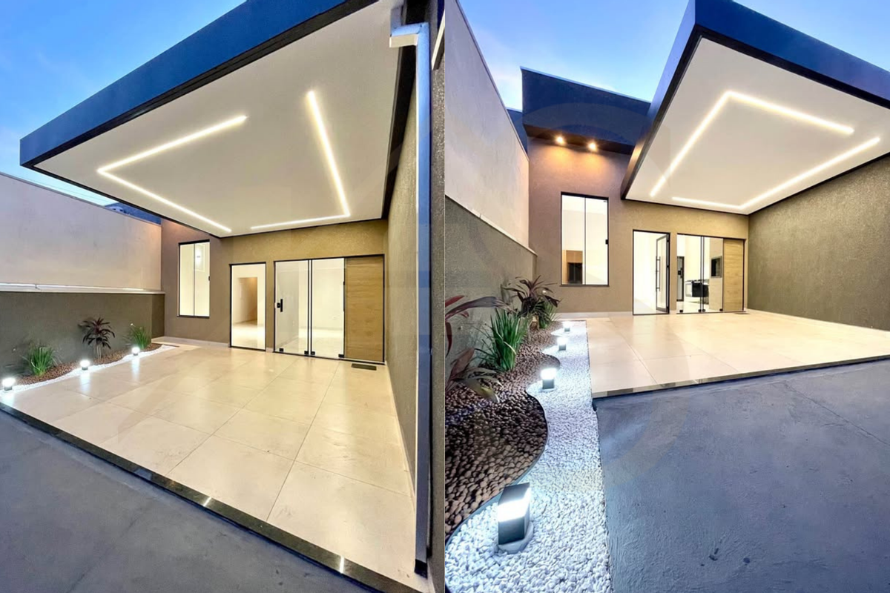

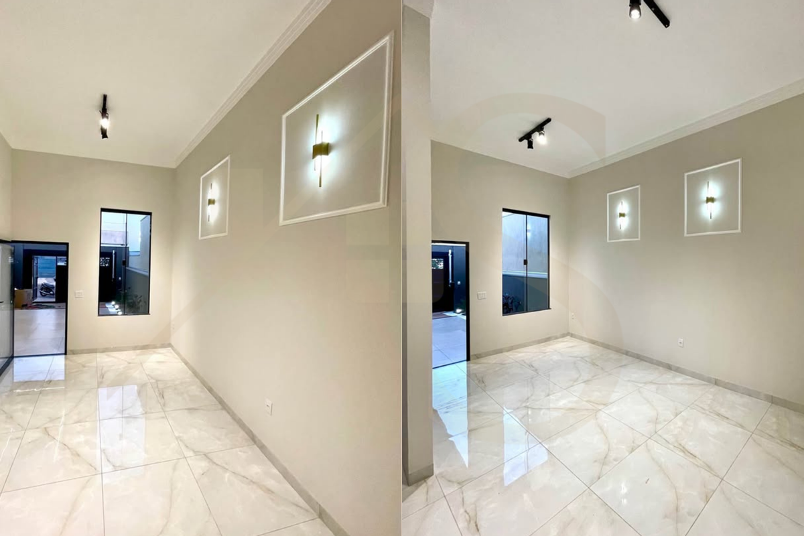

🔗 [Ver no site](https://imovel.sicadiweb.com.br/VENDA/DVI-IM-710C84E8650B436EADDF412102EEAB07/IAC-IMOB-35AC99F2)

---

## 40. Casa para Venda-Residencial Ilha Bela

- **Código:** 00099
- **Tipo:** Casa | **Finalidade:** Venda
- **Valor:** R$ 800.000
- **Endereço:** Rua Oswald de Andrade, 187, Residencial Ilha Bela - Ilha Solteira/SP
- **CEP:** 15387082
- **Composição:** 3 Quartos (sendo 1 Suíte), 2 Banheiros, 3 Vagas, 1m²

> 
> Apresentamos uma residência moderna, completa e pronta para morar!
> 
> Perfeita para quem busca conforto, sustentabilidade e lazer em um só lugar.
> 
> Descrição:
> -03 dormitórios (sendo 1 suíte com closet)
> -Sala de estar
> -Sala de jantar
> -Cozinha com forno elétrico
> -Área gourmet completa
> -Piscina com aquecimento solar próprio
> -Placas solares instaladas
> 
> Bairro: Ilha Bela
> Disponível para venda
> 
> R$800.000,00

**📷 12 foto(s):**

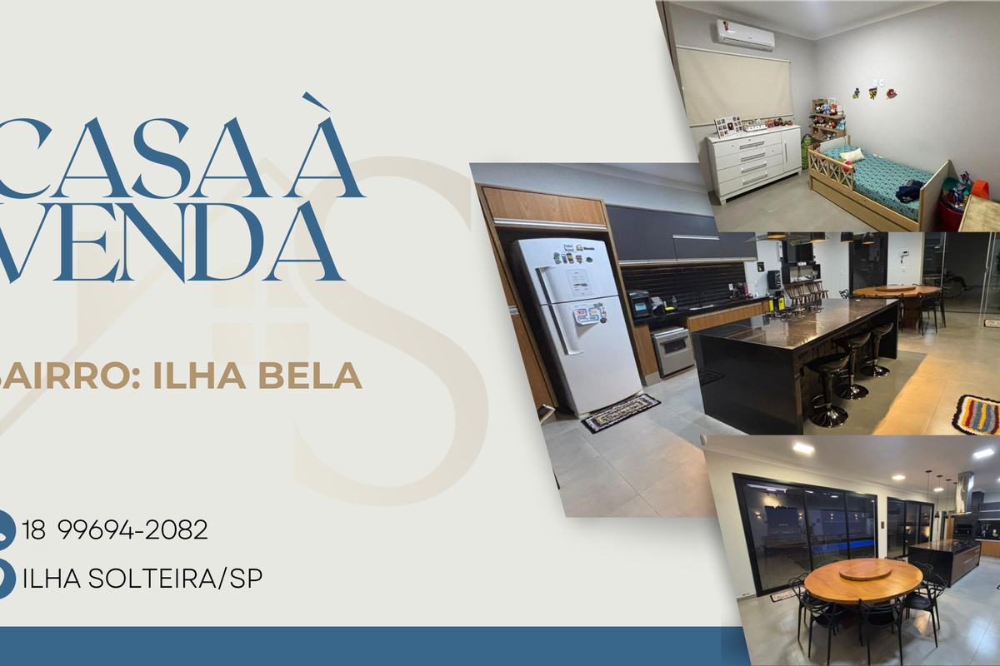

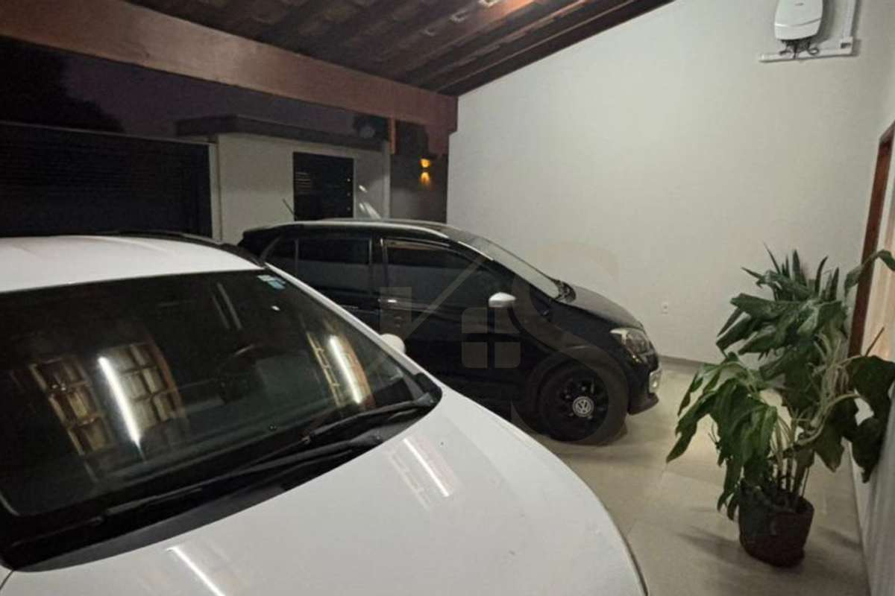

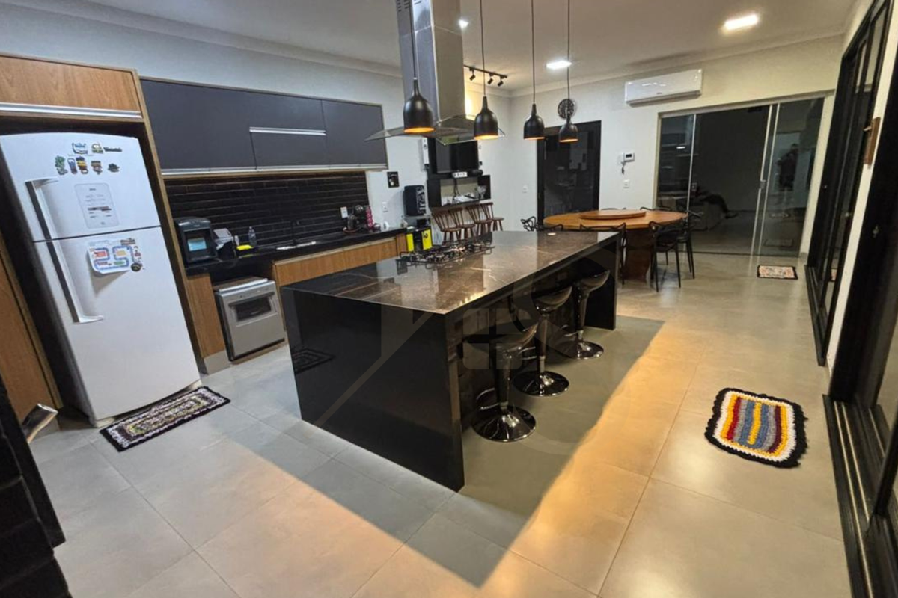

🔗 [Ver no site](https://imovel.sicadiweb.com.br/VENDA/DVI-IM-75B5E79079B84D238B2B585F45B466A2/IAC-IMOB-35AC99F2)

---

## 41. Casa à Venda no Residencial Portal do Sol – Conforto e Sofisticação!

- **Código:** 00024
- **Tipo:** Casa | **Finalidade:** Venda
- **Valor:** R$ 800.000
- **Endereço:** Rua Campos Novos, 86, Portal do Sol - Ilha Solteira/SP
- **CEP:** 15388274
- **Composição:** 398m²
- **Características:** Área de serviço, Banheiro da suíte, Calçada, Corredor, Quintal, Sala, Sala de TV, Sala de jantar

> Se você busca qualidade de vida, segurança e sofisticação, esta casa no Residencial Portal do Sol é a escolha ideal! Localizada em um condomínio fechado, com portaria 24h, oferece o melhor para você e sua família.
> 
> Destaques do imóvel:
> Suítes espaçosas para mais privacidade
> Quartos amplos e bem iluminados
> Banheira para seu relaxamento
> Cozinha grande e funcional
> Sala de TV perfeita para entretenimento
> Sala de estar aconchegante
> Sala de jantar ideal para reunir a família
> Lavand

**📷 22 foto(s):**

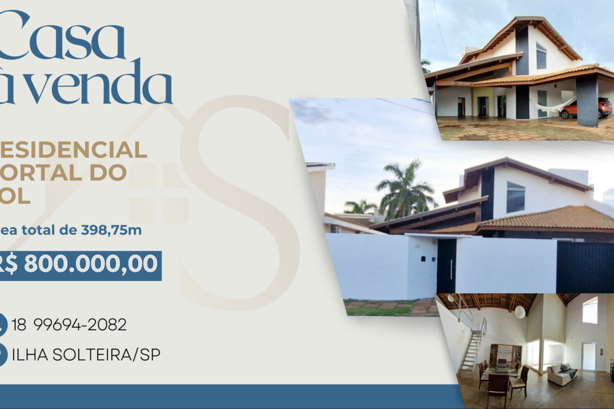

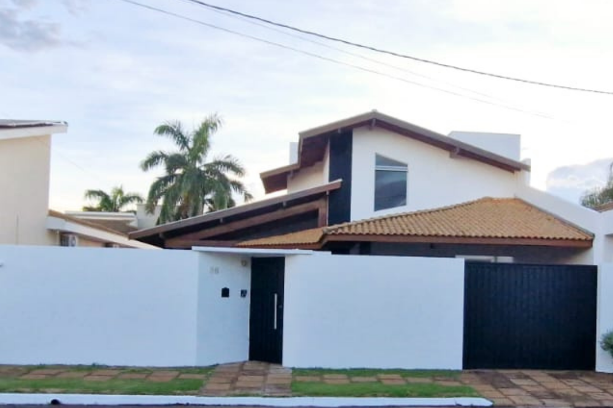

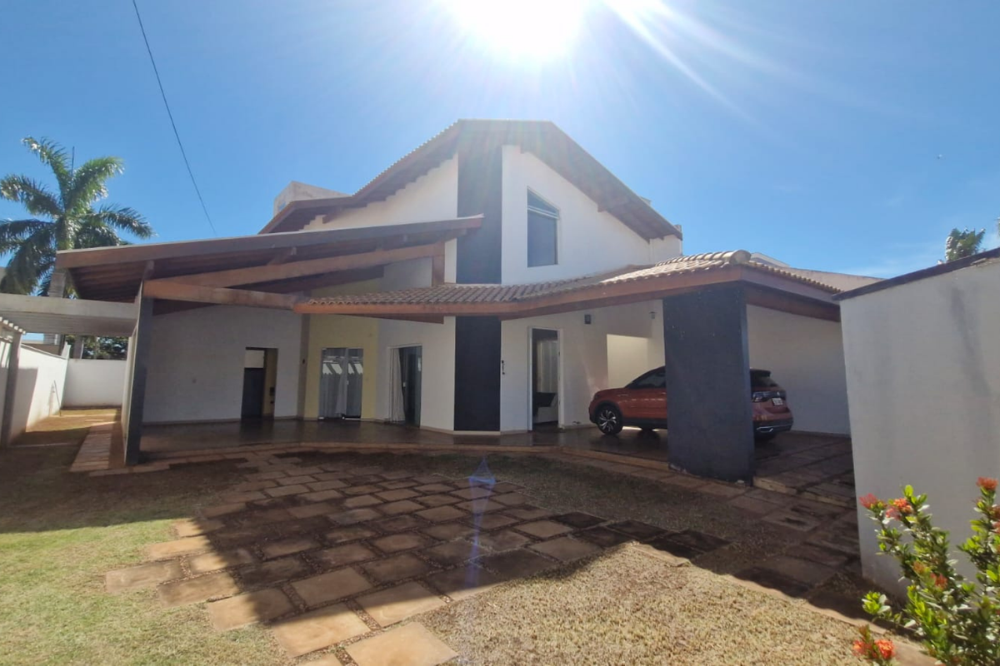

🔗 [Ver no site](https://imovel.sicadiweb.com.br/VENDA/DVI-IM-CC05E8B8660545A2BE240B1F93F52051/IAC-IMOB-35AC99F2)

---

## 42. Ponto Comercial - Em frente ao hospital

- **Código:** 00082
- **Tipo:** Ponto Comercial | **Finalidade:** Venda
- **Valor:** R$ 750.000
- **Endereço:** Passeio Prado, 103, Zona Norte - Ilha Solteira/SP
- **CEP:** 15385190
- **Composição:** 3 Quartos, 3 Banheiros, 86m²
- **Características:** Corredor, Cozinha, Depósito, Escritório

> Localizado em frente ao hospital da cidade, um ponto estratégico com grande fluxo de pessoas e visibilidade garantida.
> 
> O imóvel conta com recepção, duas salas principais, quatro banheiros, sendo um com acessibilidade, copa, além de uma sala de apoio que pode ser usada como estoque, escritório ou o que você precisar.
> 
> Espaço ideal para clínicas, consultórios, escritórios ou qualquer atividade que precise de praticidade, conforto e localização privilegiada. 

**📷 10 foto(s):**

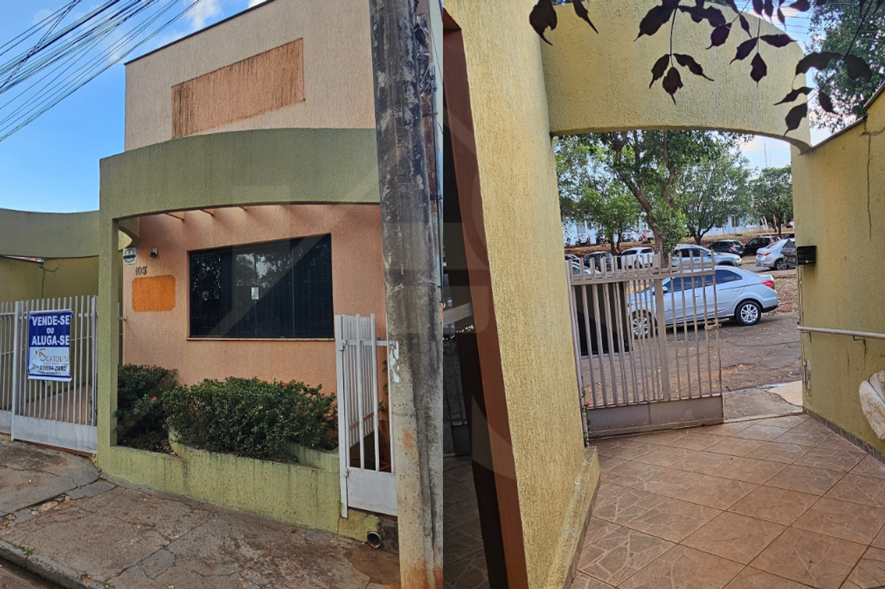

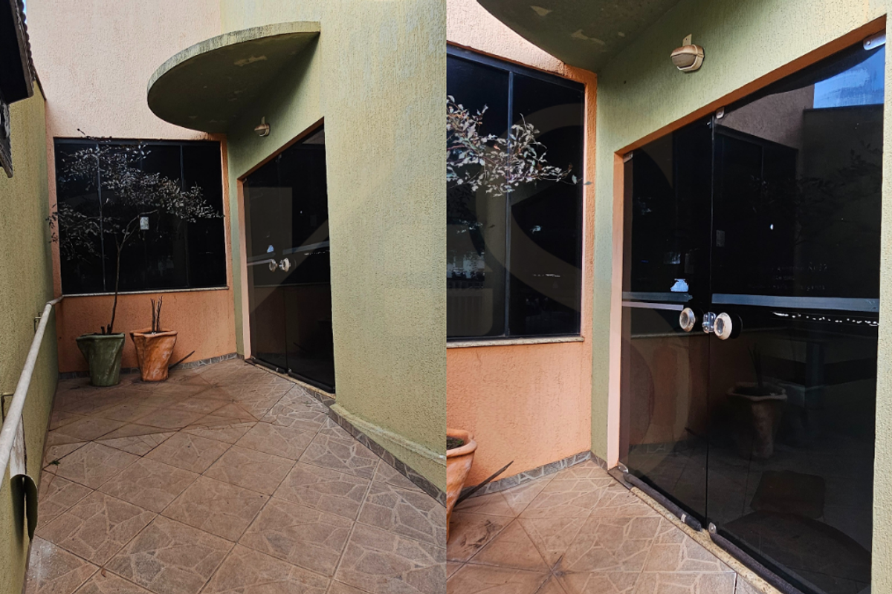

🔗 [Ver no site](https://imovel.sicadiweb.com.br/VENDA/DVI-IM-D4BA21ABAF2A42739A1BA7B314BD4266/IAC-IMOB-35AC99F2)

---

## 43. Casa 4 quartos à venda Jardim Aeroporto, Ilha Solteira

- **Código:** 00068
- **Tipo:** Casa | **Finalidade:** Venda
- **Valor:** R$ 300.000
- **Endereço:** Rua 37, 8, Jardim Aeroporto - Ilha Solteira/SP
- **CEP:** 15387006
- **Composição:** 4 Quartos (sendo 1 Suíte), 2 Banheiros, 2 Vagas, 1m²
- **Características:** Lavabo, Quintal, Área de lazer, Churrasqueira, Corredor, Sala, Sala de jantar, Banheiro área de lazer, Edícula, Cozinha, Calçada, Banheiro da suíte

> Ampla e confortável – ideal para sua família!
> 
> Casa com excelente estrutura, disponível para locação:
> 
> 4 quartos (sendo 1 suíte)
> 
> 1 banheiro + 1 lavabo
> 
> Portão eletrônico e interfone
> 
> Lavanderia coberta
> 
> Garagem para 2 carros
> 
> Área pronta para churrasqueira
> 
> VALOR PARA VENDA: A NEGOCIAR
> 
> Aproveite essa oportunidade!
> Entre em contato e agende sua visita.
> 
> (18) 99694-2082 – Scatolin Imóveis
> 
> 

**📷 5 foto(s):**

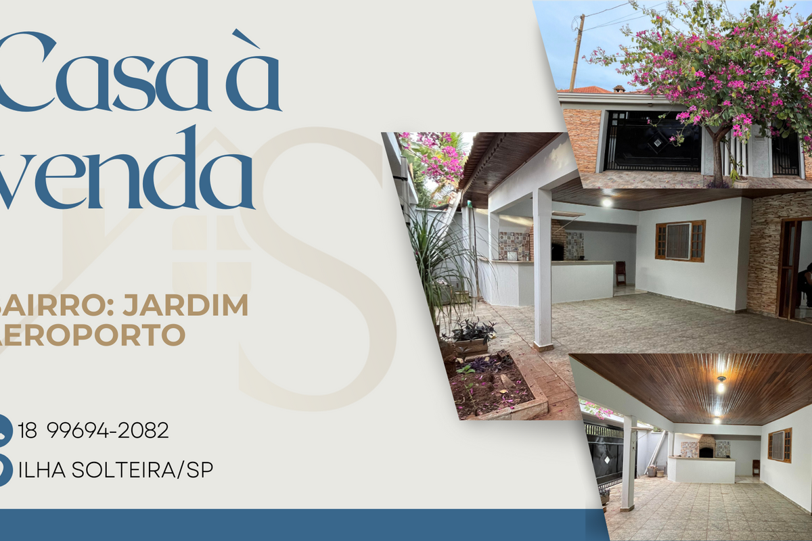

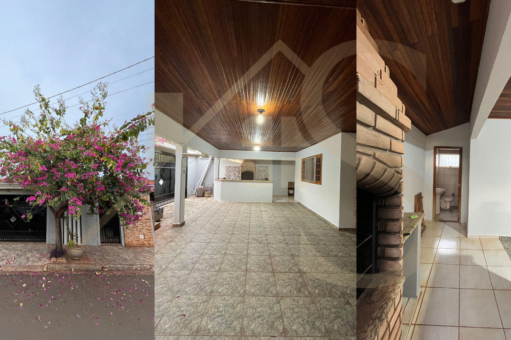

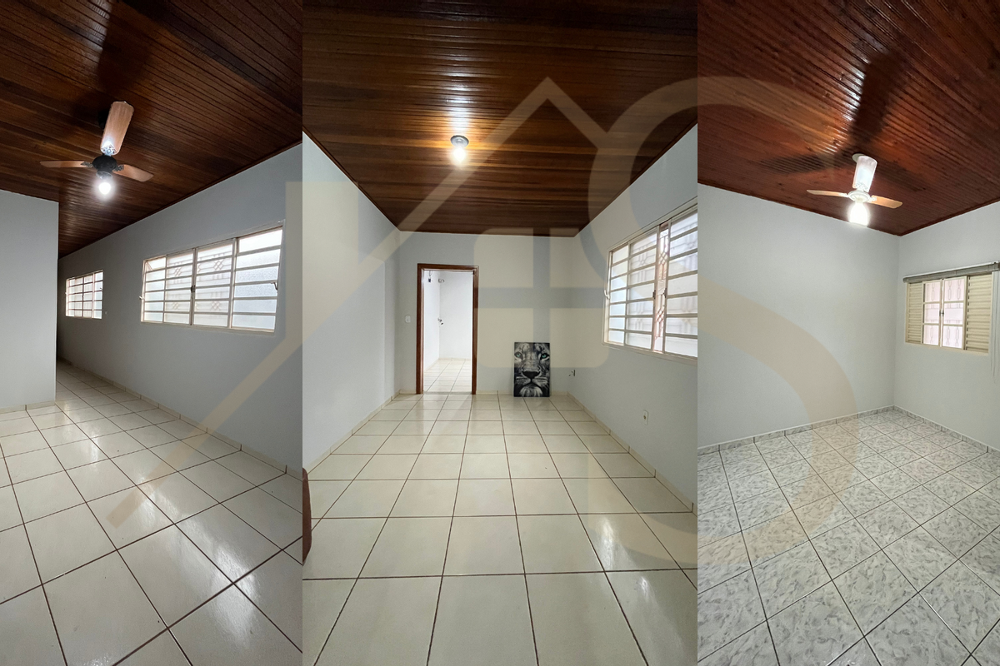

🔗 [Ver no site](https://imovel.sicadiweb.com.br/VENDA/DVI-IM-DA3F356DEF8045449EAE7A02608C621D/IAC-IMOB-35AC99F2)

---

## 44. Ponto Comercial com casa nos fundos

- **Código:** 00095
- **Tipo:** Ponto Comercial | **Finalidade:** Venda
- **Valor:** R$ 1.200.000
- **Endereço:** Avenida 15 de Outubro, 832, Jardim Aeroporto - Ilha Solteira/SP
- **CEP:** 15387070
- **Composição:** 3 Quartos, 2 Banheiros, 1m²

> Invista no endereço certo para o seu negócio!
> 
> Na Avenida 15 de Outubro, uma das principais rotas comerciais da cidade, está disponível um imóvel completo para quem deseja empreender com visibilidade e movimento constante.
> 
> O ponto comercial já possui estrutura pronta para funcionamento imediato e atende diversos segmentos.
> 
> Área Comercial
> -Localização privilegiada, com intenso fluxo de pessoas e veículos
> -Dois ambientes
> -Depósitos amplos para destaque e suporte operacional
> -

**📷 9 foto(s):**

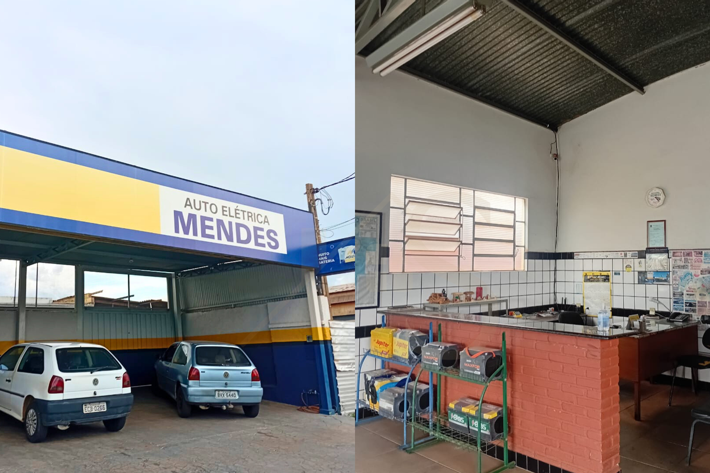

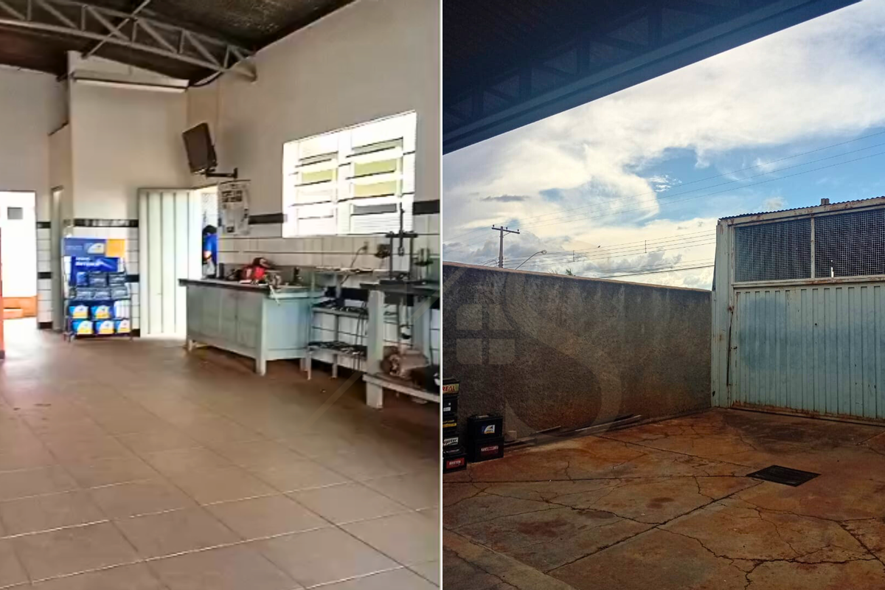

🔗 [Ver no site](https://imovel.sicadiweb.com.br/VENDA/DVI-IM-E0C7A181E6314D72B9B2B8E4D368183D/IAC-IMOB-35AC99F2)

---

## 45. Casa Inteligente à Venda 

- **Código:** 00055
- **Tipo:** Casa | **Finalidade:** Venda
- **Valor:** R$ 750.000
- **Endereço:** Rua Rachel de Queiroz, , Jardim Ilha do Sol - Ilha Solteira/SP
- **CEP:** 15387224
- **Composição:** 3 Quartos (sendo 2 Suítes), 3 Banheiros, 1m²
- **Características:** Banheiro área de lazer, Banheiro da suíte, Churrasqueira, Corredor, Cozinha, Piscina, Sala

> Tecnologia, conforto e sofisticação em um só lugar! Esse imóvel completo oferece tudo o que você e sua família precisam para viver com praticidade e estilo.
> 
>  Destaques desta oportunidade imperdível:
>  2 suítes – Mais privacidade e conforto para todos!
>  1 quarto - Tamanho excelente para você transformá-lo no que quiser.
>  Sala ampla – Ideal para relaxar ou receber visitas com charme!
>  Banheiro social – Comodidade para o dia a dia!
>  Cozinha mobiliada – Totalmente equipada, pronta para

**📷 7 foto(s):**

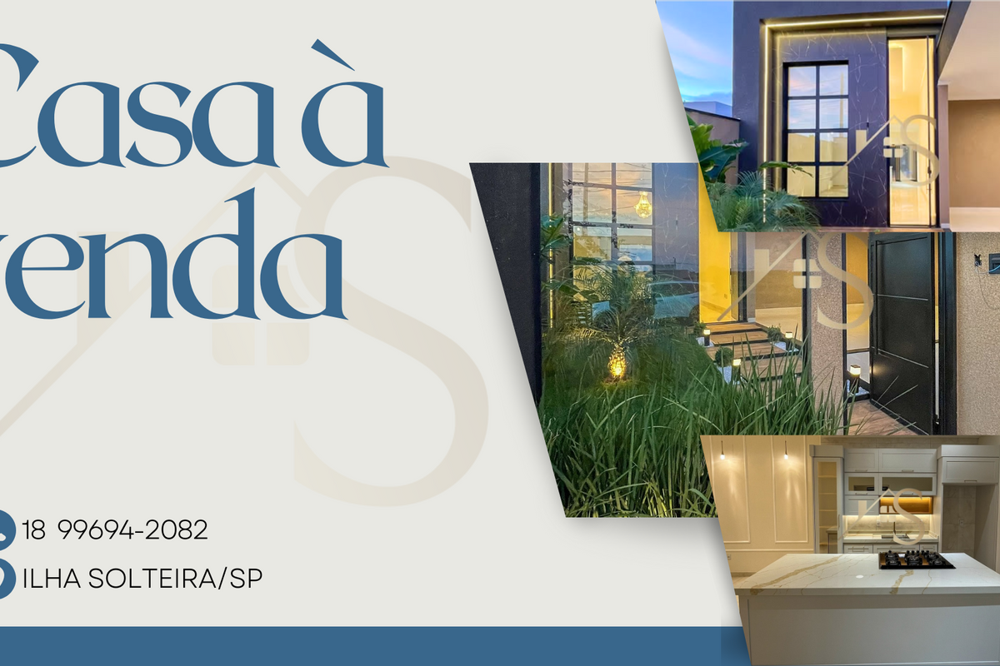

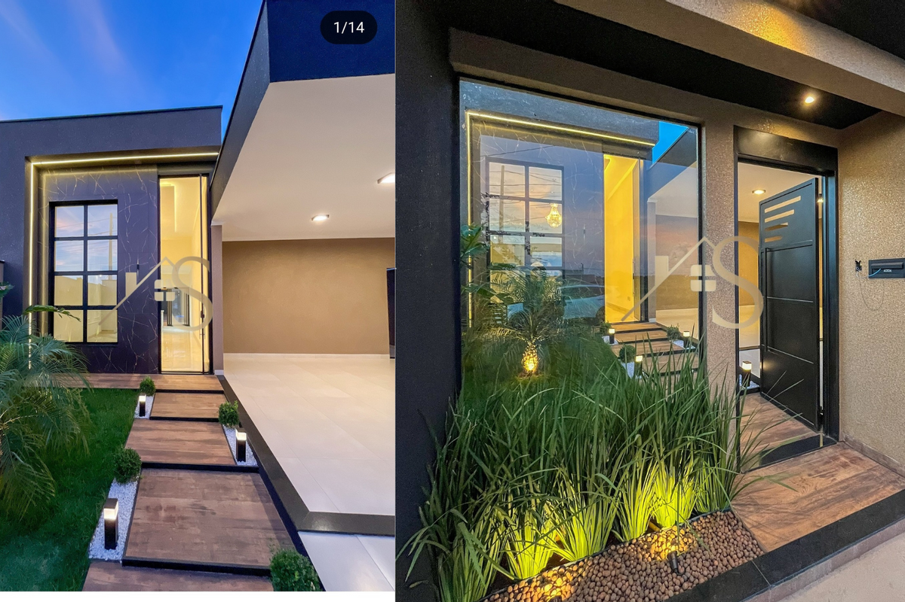

🔗 [Ver no site](https://imovel.sicadiweb.com.br/VENDA/DVI-IM-E34A3B00892E4DA397206BA60F5C0E73/IAC-IMOB-35AC99F2)

---

## 46. Casa 3 quartos para Venda Zona Norte, Ilha Solteira

- **Código:** 00072
- **Tipo:** Casa | **Finalidade:** Venda
- **Valor:** R$ 260.000
- **Endereço:** Passeio Colinas, 304, Zona Norte - Ilha Solteira/SP
- **CEP:** 15385100
- **Composição:** 3 Quartos, 1 Banheiro, 2 Vagas, 1m²
- **Características:** Corredor, Cozinha, Quintal, Sala

> Oportunidade Imperdível! Sua nova casa está aqui!
> 
> Endereço: Passeio Colinas, 304 – Zona Norte
> 
> Características do imóvel:
> 
> - 3 quartos
> - Sala espaçosa
> - Cozinha
> - Quintal com excelente espaço
> - Garagem coberta para 2 carros
> - Energia solar instalada
> - 2 aparelhos de ar-condicionado
> 
> Casa nível 04, de esquina – mais privacidade e ventilação!
> 
> Tudo isso por apenas: R$ 260.000,00
> 
> Agende sua visita agora mesmo e venha se encantar!

**📷 8 foto(s):**

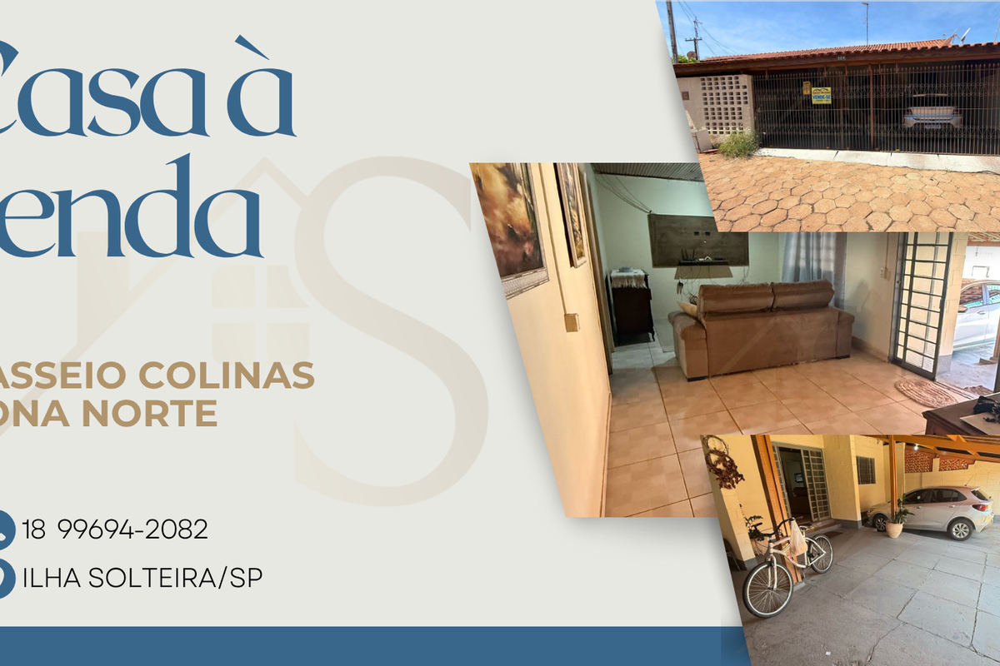

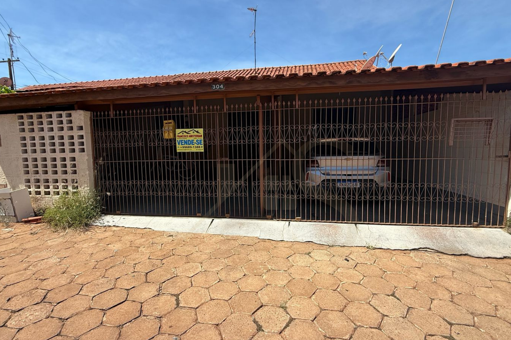

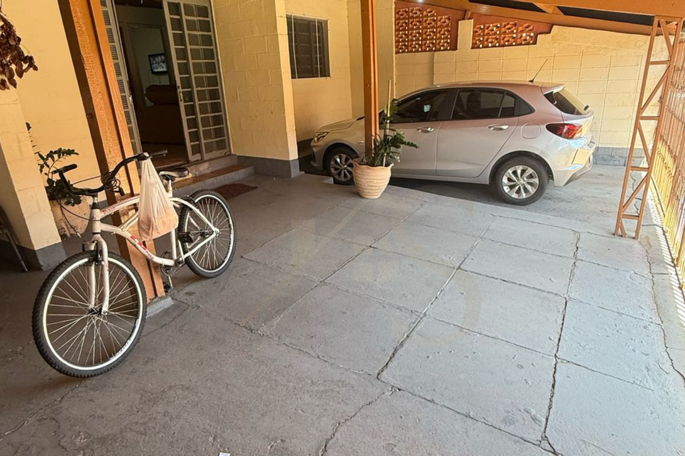

🔗 [Ver no site](https://imovel.sicadiweb.com.br/VENDA/DVI-IM-F9D69A3A82EC4FAEBC472705B8FBF02A/IAC-IMOB-35AC99F2)

---

